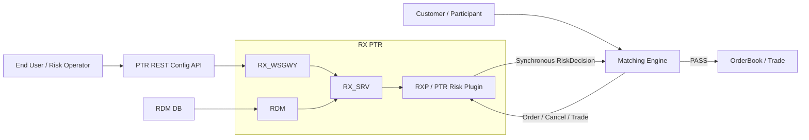
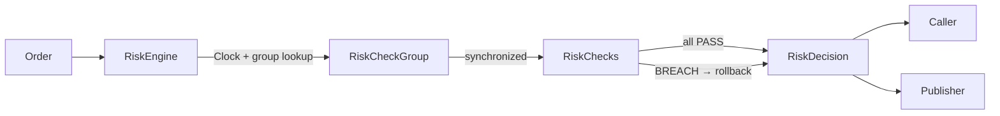
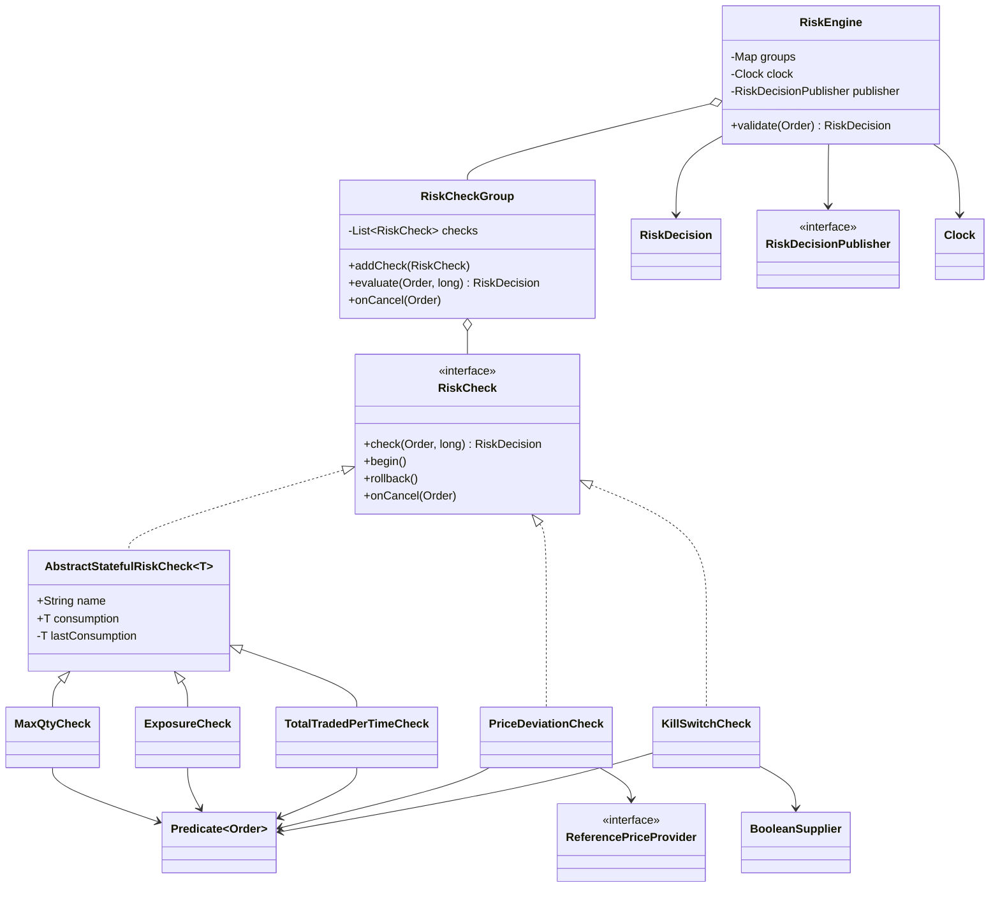
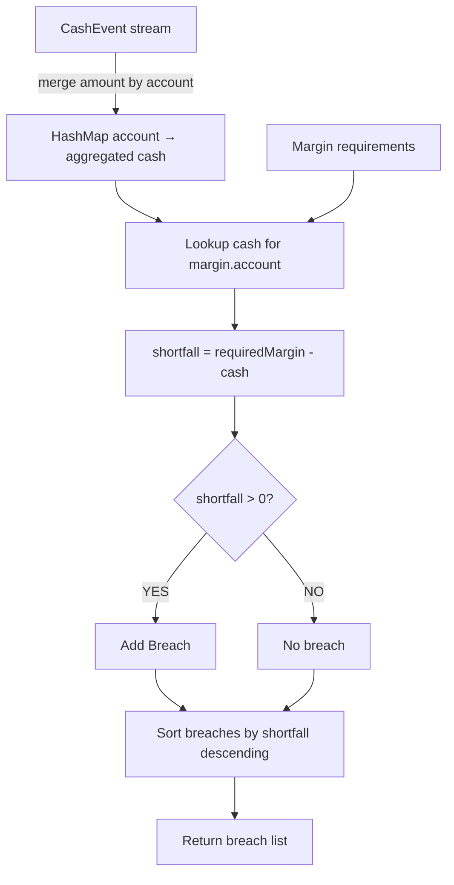
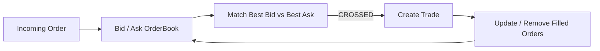

# Point72 — Treasury Technology
## Final 10:00 AM → 1:00 PM Activation Plan

**Interview:** 11 Sep 2026, 1:30–2:30 PM IST  
**Study stop:** **12:45 PM**. Use 12:45–1:00 only for setup.

> **Canonical RiskLimitEngine rule:** learn only the structure derived from the attached `RiskLimitEngine(2).java`. The study version below keeps that architecture and applies only the agreed corrections: ticker filtering in `MaxQtyCheck`, checked arithmetic in `TotalTradedPerTimeCheck`, and the preferred check name.

---

# 1. Source hierarchy

Use these only when the corresponding section below feels weak; do not read them linearly.

| Source | Unique purpose |
|---|---|
| `Point72_Master_Revision_HackerRank_SQL_DSA_LLD_HLD.md` | Controls this round: Java live coding first; SQL/LLD/project are bounded hedges |
| `GoldmanSachs_Master_Revision_DSA_LLD_HLD.md` | Timed reconstruction and communication discipline |
| `WellsFargo_Master_Revision_DSA_LLD_HLD (2).md` | Trading-oriented DSA/LLD/HLD reference |
| `RiskLimitEngine(2).java` | Canonical risk-engine architecture for hand coding |
| `MatchingEngine(2).java` | Canonical matching-engine code for eye/verbal review |

Do not spend active morning time on C#/.NET syntax, React, deep HLD, infrastructure internals, benchmark numbers, new hard DSA, or large handbook rereads.

---

# 2. Exact morning sequence

| Time | Task | Required output |
|---|---|---|
| **10:00–10:15** | Java DSA warm-up | One already-solved problem from blank; narrate invariant + tests + complexity |
| **10:15–10:45** | **RiskLimitEngine** | Reconstruct through `RiskEngine.validate()`; add the remaining checks if time |
| **10:45–11:10** | **TreasuryMarginMonitor** | Reconstruct aggregation → breach → ordering |
| **11:10–11:30** | Java core/API | Answer the theory bank below without notes |
| **11:30–11:45** | Java Streams | Write the six stream shapes below |
| **11:45–12:05** | SQL Server | Write the four queries + answer index/transaction questions |
| **12:05–12:20** | DSA retrieval | P0 six first; P1 only if recall is immediate |
| **12:20–12:30** | Treasury + LLD | Margin service + OMS/OrderBook verbal anchors |
| **12:30–12:40** | PTR/resume hedge | 60-sec PTR + 90-sec negative-exposure story |
| **12:40–12:45** | Final retrieval + opening | Use §15 once; speak the §3 opening; then close notes |
| **12:45–1:00** | **No study** | Water, washroom, Zoom/HackerRank, audio, charger, blank paper |

---

# 3. Live-coding operating loop

Opening:

> “As discussed, I’ll implement in Java. I’ll first restate the contract and clarify the important constraints, then outline the approach and complexity before I code.”

Use one loop for every coding question:

```text
contract
→ example / ambiguity
→ baseline
→ invariant
→ code
→ normal + boundary + adversarial tests
→ time / space
→ one follow-up
```

If given a hint:

> “That suggests __. Let me connect it to the invariant: __.”

If a test fails:

> “I expected __ and observed __. I’ll trace the first state divergence before changing the algorithm.”

---

# 4. RiskLimitEngine — final extensible version

> **Deep-dive archive:** the detailed risk-engine discussion is preserved separately in `RISK_ENGINE_DEEP_DIVE_LEARNING.md`. The section below is the interview retrieval path; no learning has been intentionally discarded.


## 4.1 What to know for one interview

Memorize only this:

```text
1. HIGH LEVEL
customer order path + PTR control/config path

2. LOW LEVEL
RiskEngine → RiskCheckGroup → RiskChecks → RiskDecision

3. CLASS LEVEL
stable interfaces + replaceable implementations + injected dependencies

4. ONE PRODUCTION STORY
DEFAULT PTLG startup/readiness → missing exposure increment → later cancel → negative exposure

5. FIVE FOLLOW-UPS
concurrency
scope
time
money representation
new-rule extension
```

Everything else in this section is drill-down material, not a second syllabus.

---

## 4.2 Mermaid — high-level PTR / exchange system



Interview narration:

```text
CONTROL / CONFIG
End User
→ PTR REST Config API
→ RX_WSGWY / RX_SRV
← RDM / RDM DB
→ initialize or update in-memory risk state

HOT DATA PATH
Customer
→ Matching Engine
↔ RXP / PTR Risk Plugin
→ PASS   → OrderBook / Trade
→ BREACH → reject
```

The important architectural distinction is:

> **Configuration/persistence can be richer; the order decision path stays synchronous and in memory.**

Use the RX arrows as a **simplified interview map**. Do not claim every arrow is the exact transport hop in every PTR deployment.

Deployment is a separate concern:

```text
ON-PREM → Linux TDE nodes / SSH
AWS     → Docker → EKS → 2 Deployments → Pods
```

---

## 4.3 Mermaid — low-level RiskEngine flow



Inside `RiskChecks`:

```text
Predicate<Order>
→ does this rule apply?

if yes
→ evaluate rule
→ update provisional state if stateful

first BREACH
→ stop
→ rollback group snapshot

all PASS
→ keep state
```

Concurrency rule:

> **The group lock protects the business invariant, so individual `consumption` fields do not need separate atomics.**

State lifetime:

```text
ConcurrentHashMap
→ same RiskCheckGroup object
→ same RiskCheck objects
→ accepted consumption survives validate() calls
→ process restart requires state reconstruction
```

---

## 4.4 Mermaid — class-level extensible design



Three extension seams to remember:

```text
NEW RULE
→ implement RiskCheck
→ addCheck(...)

NEW APPLICABILITY
→ inject another Predicate<Order>

NEW INFRASTRUCTURE
→ inject another Clock / Publisher / ReferencePriceProvider / BooleanSupplier
```

No new rule should require modifying `RiskEngine`.

---

## 4.5 Complete Java — compile-verified

```java
import java.math.BigDecimal;
import java.time.Clock;
import java.time.Instant;
import java.util.ArrayList;
import java.util.List;
import java.util.Map;
import java.util.Objects;
import java.util.Set;
import java.util.concurrent.ConcurrentHashMap;
import java.util.concurrent.atomic.AtomicBoolean;
import java.util.function.BooleanSupplier;
import java.util.function.Predicate;

enum Side {
    Buy,
    Sell
}

enum Result {
    PASS,
    BREACH
}

class Account {

    final int id;
    final String name;

    Account(int id, String name) {
        this.id = id;
        this.name = Objects.requireNonNull(name);
    }

    @Override
    public String toString() {
        return name;
    }
}

class Order {

    final String orderId;
    final Account account;
    final String ticker;
    final String marketSegment;
    final Side side;
    final BigDecimal price;
    final long quantity;

    /*
     * Event time belongs to the order.
     * Processing time comes from the injected Clock in RiskEngine.
     */
    final Instant eventTime;

    Order(
            String orderId,
            Account account,
            String ticker,
            String marketSegment,
            Side side,
            BigDecimal price,
            long quantity,
            Instant eventTime) {

        this.orderId = Objects.requireNonNull(orderId);
        this.account = Objects.requireNonNull(account);
        this.ticker = Objects.requireNonNull(ticker);
        this.marketSegment = Objects.requireNonNull(marketSegment);
        this.side = Objects.requireNonNull(side);
        this.price = Objects.requireNonNull(price);
        this.eventTime = Objects.requireNonNull(eventTime);

        if (price.signum() <= 0) {
            throw new IllegalArgumentException("price must be positive");
        }

        if (quantity <= 0) {
            throw new IllegalArgumentException("quantity must be positive");
        }

        this.quantity = quantity;
    }
}

/*
 * The single decision object used outside a RiskCheck.
 *
 * It can be:
 * - returned synchronously to the order path
 * - published to a bus
 * - logged/audited
 *
 * Result is only the status field inside the decision.
 */
record RiskDecision(
        String orderId,
        int accountId,
        String ticker,
        Result result,
        String checkName,
        String reason,
        Instant decidedAt) {

    static RiskDecision pass(
            Order order,
            long nowMs) {

        return new RiskDecision(
                order.orderId,
                order.account.id,
                order.ticker,
                Result.PASS,
                "NONE",
                "OK",
                Instant.ofEpochMilli(nowMs));
    }

    static RiskDecision breach(
            Order order,
            long nowMs,
            String checkName,
            String reason) {

        return new RiskDecision(
                order.orderId,
                order.account.id,
                order.ticker,
                Result.BREACH,
                checkName,
                reason,
                Instant.ofEpochMilli(nowMs));
    }

    boolean accepted() {
        return result == Result.PASS;
    }
}

/*
 * Infrastructure port.
 *
 * Production can inject an asynchronous message-bus adapter.
 * Tests can inject an in-memory/no-op lambda.
 */
@FunctionalInterface
interface RiskDecisionPublisher {

    void publish(RiskDecision decision);
}

/*
 * Market-data port.
 *
 * PriceDeviationCheck does not know where reference prices come from.
 */
@FunctionalInterface
interface ReferencePriceProvider {

    BigDecimal referencePrice(Order order);
}

/*
 * Universal rule contract.
 *
 * Stateful checks override begin/rollback/onCancel.
 * Stateless checks implement only check().
 */
interface RiskCheck {

    RiskDecision check(
            Order order,
            long nowMs);

    default void begin() {
    }

    default void rollback() {
    }

    default void onCancel(Order order) {
    }
}

/*
 * Shared transaction support for checks that own mutable state.
 *
 * T should be immutable (Long, BigDecimal, immutable value object)
 * so snapshot assignment is sufficient.
 */
abstract class AbstractStatefulRiskCheck<T>
        implements RiskCheck {

    final String name;

    T consumption;

    private T lastConsumption;

    AbstractStatefulRiskCheck(
            String name,
            T initialConsumption) {

        this.name = Objects.requireNonNull(name);
        this.consumption =
                Objects.requireNonNull(initialConsumption);
    }

    @Override
    public void begin() {
        lastConsumption = consumption;
    }

    @Override
    public void rollback() {
        consumption = lastConsumption;
    }
}

/*
 * Reusable applicability predicates.
 *
 * The rule and the scope to which it applies are separate concerns.
 */
final class Scopes {

    private Scopes() {
    }

    static Predicate<Order> all() {
        return order -> true;
    }

    static Predicate<Order> ticker(String ticker) {

        return order ->
                order.ticker.equals(ticker);
    }

    static Predicate<Order> tickers(
            Set<String> tickers) {

        Set<String> copy =
                Set.copyOf(tickers);

        return order ->
                copy.contains(order.ticker);
    }

    static Predicate<Order> marketSegment(
            String marketSegment) {

        return order ->
                order.marketSegment.equals(
                        marketSegment);
    }

    static Predicate<Order> side(Side side) {

        return order ->
                order.side == side;
    }
}

/*
 * Accumulated open quantity for any injected scope.
 *
 * Examples:
 * - one ticker BUY
 * - one ticker SELL
 * - collection of tickers
 * - market segment
 * - whole group
 */
class MaxQtyCheck
        extends AbstractStatefulRiskCheck<Long> {

    private final Predicate<Order> appliesTo;

    private final long limit;

    MaxQtyCheck(
            String name,
            Predicate<Order> appliesTo,
            long limit) {

        super(name, 0L);

        this.appliesTo =
                Objects.requireNonNull(appliesTo);

        if (limit < 0) {
            throw new IllegalArgumentException(
                    "limit must be non-negative");
        }

        this.limit = limit;
    }

    @Override
    public RiskDecision check(
            Order order,
            long nowMs) {

        if (!appliesTo.test(order)) {
            return RiskDecision.pass(
                    order,
                    nowMs);
        }

        long candidate =
                Math.addExact(
                        consumption,
                        order.quantity);

        if (candidate > limit) {

            return RiskDecision.breach(
                    order,
                    nowMs,
                    name,
                    "MAX QTY BREACH candidate="
                            + candidate
                            + " limit="
                            + limit);
        }

        consumption = candidate;

        return RiskDecision.pass(
                order,
                nowMs);
    }

    @Override
    public void onCancel(Order order) {

        if (!appliesTo.test(order)) {
            return;
        }

        consumption =
                Math.max(
                        consumption - order.quantity,
                        0L);
    }
}

/*
 * Signed net monetary exposure.
 *
 * BUY  => +price * quantity
 * SELL => -price * quantity
 *
 * BigDecimal is used here for explicit decimal money semantics.
 * A production low-latency venue may instead use fixed-point long/ticks.
 */
class ExposureCheck
        extends AbstractStatefulRiskCheck<BigDecimal> {

    private final Predicate<Order> appliesTo;

    private final BigDecimal limit;

    ExposureCheck(
            String name,
            Predicate<Order> appliesTo,
            BigDecimal limit) {

        super(
                name,
                BigDecimal.ZERO);

        this.appliesTo =
                Objects.requireNonNull(appliesTo);

        this.limit =
                Objects.requireNonNull(limit);

        if (limit.signum() < 0) {
            throw new IllegalArgumentException(
                    "limit must be non-negative");
        }
    }

    @Override
    public RiskDecision check(
            Order order,
            long nowMs) {

        if (!appliesTo.test(order)) {
            return RiskDecision.pass(
                    order,
                    nowMs);
        }

        BigDecimal delta =
                signedValue(order);

        BigDecimal candidate =
                consumption.add(delta);

        if (candidate.abs()
                .compareTo(limit) > 0) {

            return RiskDecision.breach(
                    order,
                    nowMs,
                    name,
                    "EXPOSURE BREACH candidate="
                            + candidate.toPlainString()
                            + " limit="
                            + limit.toPlainString());
        }

        consumption = candidate;

        return RiskDecision.pass(
                order,
                nowMs);
    }

    @Override
    public void onCancel(Order order) {

        if (!appliesTo.test(order)) {
            return;
        }

        consumption =
                consumption.subtract(
                        signedValue(order));
    }

    private BigDecimal signedValue(
            Order order) {

        BigDecimal value =
                order.price.multiply(
                        BigDecimal.valueOf(
                                order.quantity));

        return order.side == Side.Buy
                ? value
                : value.negate();
    }
}

/*
 * Fixed processing-time window.
 *
 * Scope and window duration are constructor-injected.
 */
class TotalTradedPerTimeCheck
        extends AbstractStatefulRiskCheck<BigDecimal> {

    private final Predicate<Order> appliesTo;

    private final BigDecimal limit;

    private final long windowMs;

    private long windowStartMs = -1L;

    private long lastWindowStartMs;

    TotalTradedPerTimeCheck(
            String name,
            Predicate<Order> appliesTo,
            BigDecimal limit,
            long windowMs) {

        super(
                name,
                BigDecimal.ZERO);

        this.appliesTo =
                Objects.requireNonNull(appliesTo);

        this.limit =
                Objects.requireNonNull(limit);

        if (limit.signum() < 0) {
            throw new IllegalArgumentException(
                    "limit must be non-negative");
        }

        if (windowMs <= 0) {
            throw new IllegalArgumentException(
                    "windowMs must be positive");
        }

        this.windowMs = windowMs;
    }

    @Override
    public void begin() {
        super.begin();
        lastWindowStartMs =
                windowStartMs;
    }

    @Override
    public void rollback() {
        super.rollback();
        windowStartMs =
                lastWindowStartMs;
    }

    @Override
    public RiskDecision check(
            Order order,
            long nowMs) {

        if (!appliesTo.test(order)) {
            return RiskDecision.pass(
                    order,
                    nowMs);
        }

        if (windowStartMs < 0
                || nowMs - windowStartMs
                >= windowMs) {

            windowStartMs = nowMs;
            consumption =
                    BigDecimal.ZERO;
        }

        BigDecimal value =
                order.price.multiply(
                        BigDecimal.valueOf(
                                order.quantity));

        BigDecimal candidate =
                consumption.add(value);

        if (candidate.compareTo(limit) > 0) {

            return RiskDecision.breach(
                    order,
                    nowMs,
                    name,
                    "TOTAL PER TIME BREACH candidate="
                            + candidate.toPlainString()
                            + " limit="
                            + limit.toPlainString());
        }

        consumption = candidate;

        return RiskDecision.pass(
                order,
                nowMs);
    }
}

/*
 * Stateless rule.
 *
 * ReferencePriceProvider is injected so this check is independent
 * of market-data storage/transport.
 */
class PriceDeviationCheck
        implements RiskCheck {

    private static final
    BigDecimal BPS =
            BigDecimal.valueOf(10_000L);

    private final String name;

    private final Predicate<Order> appliesTo;

    private final
    ReferencePriceProvider referencePriceProvider;

    private final long maxDeviationBps;

    PriceDeviationCheck(
            String name,
            Predicate<Order> appliesTo,
            ReferencePriceProvider referencePriceProvider,
            long maxDeviationBps) {

        this.name =
                Objects.requireNonNull(name);

        this.appliesTo =
                Objects.requireNonNull(appliesTo);

        this.referencePriceProvider =
                Objects.requireNonNull(
                        referencePriceProvider);

        if (maxDeviationBps < 0) {
            throw new IllegalArgumentException(
                    "maxDeviationBps must be non-negative");
        }

        this.maxDeviationBps =
                maxDeviationBps;
    }

    @Override
    public RiskDecision check(
            Order order,
            long nowMs) {

        if (!appliesTo.test(order)) {
            return RiskDecision.pass(
                    order,
                    nowMs);
        }

        BigDecimal referencePrice =
                referencePriceProvider
                        .referencePrice(order);

        if (referencePrice == null
                || referencePrice.signum() <= 0) {

            return RiskDecision.breach(
                    order,
                    nowMs,
                    name,
                    "REFERENCE PRICE UNAVAILABLE");
        }

        BigDecimal deviation =
                order.price
                        .subtract(referencePrice)
                        .abs();

        /*
         * deviation / referencePrice * 10_000 > maxDeviationBps
         *
         * Cross-multiplication avoids division/rounding:
         *
         * deviation * 10_000
         * >
         * referencePrice * maxDeviationBps
         */
        BigDecimal actual =
                deviation.multiply(BPS);

        BigDecimal allowed =
                referencePrice.multiply(
                        BigDecimal.valueOf(
                                maxDeviationBps));

        if (actual.compareTo(allowed) > 0) {

            return RiskDecision.breach(
                    order,
                    nowMs,
                    name,
                    "PRICE DEVIATION BREACH");
        }

        return RiskDecision.pass(
                order,
                nowMs);
    }
}

/*
 * Kill-switch state is supplied from outside.
 *
 * AtomicBoolean::get is one possible injected BooleanSupplier.
 */
class KillSwitchCheck
        implements RiskCheck {

    private final String name;

    private final Predicate<Order> appliesTo;

    private final BooleanSupplier active;

    KillSwitchCheck(
            String name,
            Predicate<Order> appliesTo,
            BooleanSupplier active) {

        this.name =
                Objects.requireNonNull(name);

        this.appliesTo =
                Objects.requireNonNull(appliesTo);

        this.active =
                Objects.requireNonNull(active);
    }

    @Override
    public RiskDecision check(
            Order order,
            long nowMs) {

        if (appliesTo.test(order)
                && active.getAsBoolean()) {

            return RiskDecision.breach(
                    order,
                    nowMs,
                    name,
                    "KILL SWITCH ACTIVE");
        }

        return RiskDecision.pass(
                order,
                nowMs);
    }
}

/*
 * Owns:
 * - heterogeneous rule composition
 * - transaction snapshot/rollback
 * - synchronization for all mutable check state in this group
 *
 * consumption does NOT need AtomicLong because every state mutation
 * is performed while holding this group monitor.
 */
class RiskCheckGroup {

    final String groupId;

    private final List<RiskCheck> checks =
            new ArrayList<>();

    RiskCheckGroup(String groupId) {
        this.groupId =
                Objects.requireNonNull(groupId);
    }

    RiskCheckGroup addCheck(
            RiskCheck check) {

        checks.add(
                Objects.requireNonNull(check));

        return this;
    }

    synchronized RiskDecision evaluate(
            Order order,
            long nowMs) {

        begin();

        try {

            for (RiskCheck check : checks) {

                RiskDecision decision =
                        check.check(
                                order,
                                nowMs);

                if (!decision.accepted()) {
                    rollback();
                    return decision;
                }
            }

            return RiskDecision.pass(
                    order,
                    nowMs);

        } catch (RuntimeException e) {

            rollback();
            throw e;
        }
    }

    synchronized void onCancel(
            Order order) {

        begin();

        try {

            checks.forEach(
                    check ->
                            check.onCancel(order));

        } catch (RuntimeException e) {

            rollback();
            throw e;
        }
    }

    private void begin() {
        checks.forEach(
                RiskCheck::begin);
    }

    private void rollback() {
        checks.forEach(
                RiskCheck::rollback);
    }
}

/*
 * Composition root dependencies are constructor-injected:
 *
 * Clock                  -> processing time
 * RiskDecisionPublisher  -> bus/audit output
 *
 * RiskCheckGroup owns rule-level concurrency.
 */
class RiskEngine {

    private final
    ConcurrentHashMap<Integer, RiskCheckGroup> groups =
            new ConcurrentHashMap<>();

    private final Clock clock;

    private final
    RiskDecisionPublisher publisher;

    RiskEngine(
            Clock clock,
            RiskDecisionPublisher publisher) {

        this.clock =
                Objects.requireNonNull(clock);

        this.publisher =
                Objects.requireNonNull(publisher);
    }

    void register(
            Account account,
            RiskCheckGroup group) {

        groups.put(
                account.id,
                Objects.requireNonNull(group));
    }

    RiskDecision validate(
            Order order) {

        long nowMs =
                clock.millis();

        RiskCheckGroup group =
                groups.get(
                        order.account.id);

        RiskDecision decision;

        if (group == null) {

            decision =
                    RiskDecision.breach(
                            order,
                            nowMs,
                            "RiskEngine",
                            "NO RISK GROUP");

        } else {

            /*
             * The map retains the same group object across validate() calls.
             * The group retains the same RiskCheck objects.
             * Their instance consumption therefore survives between calls
             * until the process is restarted/rebuilt.
             */
            decision =
                    group.evaluate(
                            order,
                            nowMs);
        }

        /*
         * Keep broker-specific code outside RiskEngine.
         * Inject an asynchronous publisher in production if bus latency
         * must stay off the risk hot path.
         */
        publisher.publish(decision);

        return decision;
    }

    void onCancel(
            Order order) {

        RiskCheckGroup group =
                groups.get(
                        order.account.id);

        if (group != null) {
            group.onCancel(order);
        }
    }
}

/*
 * Composition root / wiring example.
 *
 * This is where dependencies and behavior are injected.
 */
public class RiskEngineExtensible {

    public static void main(String[] args) {

        Account account =
                new Account(
                        101,
                        "CLIENT-101");

        Set<String> techTickers =
                Set.of(
                        "AAPL",
                        "MSFT",
                        "GOOG");

        Predicate<Order> aaplBuys =
                Scopes.ticker("AAPL")
                        .and(
                                Scopes.side(
                                        Side.Buy));

        Predicate<Order> techSells =
                Scopes.tickers(techTickers)
                        .and(
                                Scopes.side(
                                        Side.Sell));

        Predicate<Order> cashEquities =
                Scopes.marketSegment(
                        "CASH");

        Predicate<Order> allOrders =
                Scopes.all();

        Map<String, BigDecimal> referencePrices =
                Map.of(
                        "AAPL",
                        new BigDecimal("200.00"),
                        "MSFT",
                        new BigDecimal("500.00"),
                        "GOOG",
                        new BigDecimal("180.00"));

        ReferencePriceProvider
                referencePriceProvider =
                order ->
                        referencePrices.get(
                                order.ticker);

        AtomicBoolean killSwitch =
                new AtomicBoolean(false);

        /*
         * In production:
         * decision -> messageBus.publish(decision)
         *
         * The adapter should normally hand off asynchronously.
         */
        RiskDecisionPublisher publisher =
                decision ->
                        System.out.println(
                                "BUS -> " + decision);

        RiskCheckGroup group =
                new RiskCheckGroup(
                        "ACCOUNT-101")

                        /*
                         * Same MaxQtyCheck class.
                         * Different injected scopes.
                         */
                        .addCheck(
                                new MaxQtyCheck(
                                        "AAPL-BUY-OPEN-QTY",
                                        aaplBuys,
                                        1_000))

                        .addCheck(
                                new MaxQtyCheck(
                                        "TECH-SELL-OPEN-QTY",
                                        techSells,
                                        5_000))

                        /*
                         * Whole-account/group exposure.
                         */
                        .addCheck(
                                new ExposureCheck(
                                        "NET-EXPOSURE",
                                        allOrders,
                                        new BigDecimal(
                                                "10000000.00")))

                        /*
                         * Only orders in the CASH market segment.
                         */
                        .addCheck(
                                new TotalTradedPerTimeCheck(
                                        "CASH-VALUE-PER-SECOND",
                                        cashEquities,
                                        new BigDecimal(
                                                "50000000.00"),
                                        1_000L))

                        .addCheck(
                                new PriceDeviationCheck(
                                        "PRICE-DEVIATION",
                                        cashEquities,
                                        referencePriceProvider,
                                        100L))

                        .addCheck(
                                new KillSwitchCheck(
                                        "KILL-SWITCH",
                                        allOrders,
                                        killSwitch::get));

        RiskEngine engine =
                new RiskEngine(
                        Clock.systemUTC(),
                        publisher);

        engine.register(
                account,
                group);

        Order order =
                new Order(
                        "ORD-1",
                        account,
                        "AAPL",
                        "CASH",
                        Side.Buy,
                        new BigDecimal(
                                "201.00"),
                        100,
                        Instant.now());

        RiskDecision decision =
                engine.validate(order);

        System.out.println(
                "CALLER -> " + decision);

        /*
         * Feature changes require composition changes, not engine changes:
         *
         * new scope          -> inject another Predicate<Order>
         * new risk rule      -> implement RiskCheck and addCheck(...)
         * new market source  -> inject another ReferencePriceProvider
         * new bus            -> inject another RiskDecisionPublisher
         * deterministic test -> inject Clock.fixed(...)
         * kill switch source -> inject another BooleanSupplier
         */
    }
}
```

Standalone file:

```text
RiskEngineExtensible.java
```

The code above compiles with `javac`.

---

## 4.6 Where dependency injection happens

The bottom `main()` is the **composition root**.

```text
RiskEngine
← Clock
← RiskDecisionPublisher

PriceDeviationCheck
← ReferencePriceProvider

KillSwitchCheck
← BooleanSupplier

MaxQty / Exposure / Time / PriceDeviation / KillSwitch
← Predicate<Order>
```

Examples:

```text
AAPL BUY
→ Scopes.ticker("AAPL").and(Scopes.side(Buy))

TECH SELL
→ Scopes.tickers(techTickers).and(Scopes.side(Sell))

CASH segment
→ Scopes.marketSegment("CASH")

whole group
→ Scopes.all()
```

In Spring, the same constructor dependencies can be supplied by `@Configuration` / beans or a factory. The risk classes do not need Spring annotations to support constructor injection.

---

## 4.7 Open for extension, closed for modification

| Feature request | Change | Existing engine code |
|---|---|---|
| New risk rule | implement `RiskCheck`, then `addCheck()` | unchanged |
| New ticker/side combination | inject another `Predicate<Order>` | unchanged |
| Collection of tickers | `Scopes.tickers(set)` | unchanged |
| Market segment limit | compose `Scopes.marketSegment(...)` | unchanged |
| Whole-group limit | inject `Scopes.all()` | unchanged |
| Different market-data source | inject another `ReferencePriceProvider` | unchanged |
| Different bus | inject another `RiskDecisionPublisher` | unchanged |
| Deterministic test time | inject `Clock.fixed(...)` | unchanged |
| Different kill-switch source | inject another `BooleanSupplier` | unchanged |
| Different time window | constructor value `windowMs` | unchanged |

This is the OCP target:

```text
new behavior
→ add implementation or change wiring

not
→ edit RiskEngine switch/if chains
```

---

## 4.8 Scope limits of this sample

`Predicate<Order>` changes **which orders a rule sees**; it does not change the ownership domain of the group's mutable state.

Current lookup:

```text
accountId
→ one RiskCheckGroup
```

Therefore a check scoped to `marketSegment == CASH` means:

```text
CASH orders
within that group's ownership domain
```

A truly market-wide aggregate across many accounts requires either:

```text
shared market-level RiskCheckGroup
```

or a higher-level group resolver/partitioning design.

If one order must atomically update multiple independent groups, define deterministic ownership/lock ordering or route the key hierarchy through a single partition owner. Do not casually add nested locks.

---

## 4.9 Change isolation — what changes for each requirement?

OCP does **not** mean arbitrary behavior changes require zero code. It means the stable engine stays untouched and the change has one local home.

```text
CHANGE LIMIT
→ constructor/config value only

CHANGE TICKER / SIDE / SEGMENT / TICKER SET
→ Predicate<Order> only

CHANGE REFERENCE-PRICE SOURCE
→ ReferencePriceProvider implementation only

CHANGE BUS
→ RiskDecisionPublisher implementation only

CHANGE TIME SOURCE
→ Clock only

CHANGE EXISTING RULE SEMANTICS
→ that concrete RiskCheck + its tests only

ADD NEW RISK RULE
→ new RiskCheck implementation
→ one addCheck(...) wiring line

RiskEngine
RiskCheckGroup
other RiskCheck classes
→ unchanged
```

This is the target blast radius:

```text
RDM / REST configuration
        ↓
composition / factory layer
        ↓
construct rule + injected scope/dependencies
        ↓
RiskCheckGroup.addCheck(...)
        ↓
RiskEngine does not care which rules exist
```

For a production config-driven system, put RDM/REST parsing outside the rule classes. That adapter turns persisted configuration into constructor arguments / predicates. The runtime checks stay typed and do not depend on database, JSON or REST formats.

Example:

```java
Predicate<Order> scope =
        Scopes.tickers(configuredTickers)
                .and(Scopes.side(configuredSide));

RiskCheck check =
        new MaxQtyCheck(
                configuredName,
                scope,
                configuredLimit);

group.addCheck(check);
```

Changing the configured limit or scope then changes **data/wiring**, not `MaxQtyCheck`.

If a completely new rule arrives:

```java
class MaxOrderValueCheck
        implements RiskCheck {

    // only the new rule lives here
}
```

and composition adds:

```java
group.addCheck(
        new MaxOrderValueCheck(...));
```

No `switch(type)`, `if (newRule)` or edits inside `RiskEngine`.

> **Stable orchestration; replaceable rules; injected scope; injected infrastructure; configuration outside the hot-path algorithm.**

---

## 4.10 Money representation

Current extensible sample uses:

```text
quantity
→ long

price / exposure / traded value
→ BigDecimal
```

Interview distinction:

> “I would never use `double` for exact monetary risk. For ordinary financial-domain services, `BigDecimal` is a strong default. On a latency-sensitive exchange hot path, an explicitly defined fixed-point or integer-tick `long` representation can be preferable.”

The abstraction does not depend on the choice; the numeric type belongs to the concrete rule.

---

## 4.11 Retrieval anchors

```text
CONCURRENCY
→ group lock protects the whole invariant
→ not AtomicLong per field

STATE LIFETIME
→ map retains same group
→ group retains same check objects
→ their consumption survives validate() calls
→ restart requires state rebuild/recovery

SCOPE
→ Predicate<Order>

TIME
→ Clock injected into RiskEngine
→ Order.eventTime remains separate event timestamp

BUS
→ RiskDecisionPublisher
→ broker-specific code outside RiskEngine

REFERENCE PRICE
→ ReferencePriceProvider

EXTENSION
→ implement RiskCheck + addCheck
```

Strong sentence:

> **“Inject configuration, infrastructure and applicability; keep the risk algorithm dependent only on stable contracts.”**

---

# 5. TreasuryMarginMonitor — second hand-code

## Problem

Cash movements arrive for accounts. Each account has a required margin. Return accounts with positive shortfall, largest shortfall first.

## Mermaid — TreasuryMarginMonitor flow



Memory photograph:

```text
CashEvent
→ aggregate by account
→ lookup against Margin
→ shortfall = required - cash
→ shortfall > 0 = breach
→ sort breaches descending
```

## One solution

```java
Map<String, Long> cashByAccount =
        new HashMap<>();

for (CashEvent event : events) {
    cashByAccount.merge(
            event.account(),
            event.amount(),
            Long::sum);
}

List<Breach> breaches =
        new ArrayList<>();

for (Margin margin : margins) {

    long cash =
            cashByAccount.getOrDefault(
                    margin.account(),
                    0L);

    long shortfall =
            margin.required() - cash;

    if (shortfall > 0) {
        breaches.add(
                new Breach(
                        margin.account(),
                        cash,
                        margin.required(),
                        shortfall));
    }
}

breaches.sort(
        Comparator
                .comparingLong(Breach::shortfall)
                .reversed());
```

## Explanation

`HashMap` represents `account → aggregated cash`. `merge` performs the running sum. `getOrDefault(..., 0)` encodes this problem's missing-cash rule. Sorting is deferred until the final output because aggregation itself needs no ordering.

```text
T = cash events
M = margin rows
B = breaches

time  = O(T + M + B log B)
space = O(accounts + B)
```

If ordering is not required, remove the sort. If a continuously updated system repeatedly needs the worst breach, discuss a priority structure only after clarifying update semantics.

Reconciliation uses the same family: aggregate each source by the same stable key, then compare the two sides.

---


# 5A. MatchingEngine — one Mermaid + code reference

**Priority:** eye / verbal only. Do not turn this into a third mandatory hand-code exercise.

Source of truth:

```text
MatchingEngine(2).java
```

## Mermaid — MatchingEngine



```text
Incoming Order
→ Bid / Ask OrderBook
→ compare best bid vs best ask
→ if crossed: Trade
→ update quantities / remove filled orders
→ repeat
```


## Code — reference shape from `MatchingEngine(2).java`

```java
enum Side {
    BUY,
    SELL
}

static class Order {

    final int id;
    final String trader;
    final Side side;
    final int price;   // 0 = market order

    int qty;

    Order(
            int id,
            String trader,
            Side side,
            int price,
            int qty) {

        this.id = id;
        this.trader = trader;
        this.side = side;
        this.price = price;
        this.qty = qty;
    }

    boolean isMarket() {
        return price == 0;
    }
}

static class Trade {

    final int price;
    final int qty;
    final int buyId;
    final int sellId;

    Trade(
            int price,
            int qty,
            int buyId,
            int sellId) {

        this.price = price;
        this.qty = qty;
        this.buyId = buyId;
        this.sellId = sellId;
    }
}

static class OrderBook {

    final TreeMap<Integer, Queue<Order>> bids =
            new TreeMap<>(
                    Comparator.reverseOrder());

    final TreeMap<Integer, Queue<Order>> asks =
            new TreeMap<>();

    final List<Trade> trades =
            new ArrayList<>();

    String enterOrder(Order o) {

        if (!o.isMarket() && o.price <= 0)
            return "REJECTED: bad price";

        if (o.qty <= 0)
            return "REJECTED: bad qty";

        add(o);

        match();

        return "ACCEPTED";
    }

    private void match() {

        while (!bids.isEmpty()
                && !asks.isEmpty()) {

            Order bid =
                    bids.firstEntry()
                            .getValue()
                            .peek();

            Order ask =
                    asks.firstEntry()
                            .getValue()
                            .peek();

            int bidPrice =
                    bid.isMarket()
                            ? Integer.MAX_VALUE
                            : bid.price;

            int askPrice =
                    ask.isMarket()
                            ? 0
                            : ask.price;

            if (bidPrice < askPrice)
                break;

            int execPrice;

            if (bid.isMarket())
                execPrice = ask.price;

            else if (ask.isMarket())
                execPrice = bid.price;

            else
                execPrice = bid.price;

            int execQty =
                    Math.min(
                            bid.qty,
                            ask.qty);

            bid.qty -= execQty;
            ask.qty -= execQty;

            trades.add(
                    new Trade(
                            execPrice,
                            execQty,
                            bid.id,
                            ask.id));

            if (bid.qty == 0)
                remove(bids, bid);

            if (ask.qty == 0)
                remove(asks, ask);
        }
    }

    private void add(Order o) {

        int key =
                o.isMarket()
                        ? (o.side == Side.BUY
                            ? Integer.MAX_VALUE
                            : 0)
                        : o.price;

        TreeMap<Integer, Queue<Order>> book =
                o.side == Side.BUY
                        ? bids
                        : asks;

        book.computeIfAbsent(
                key,
                k -> new LinkedList<>())
            .add(o);
    }

    private void remove(
            TreeMap<Integer, Queue<Order>> book,
            Order o) {

        int key =
                o.isMarket()
                        ? (o.side == Side.BUY
                            ? Integer.MAX_VALUE
                            : 0)
                        : o.price;

        Queue<Order> q =
                book.get(key);

        if (q != null) {

            q.poll();

            if (q.isEmpty())
                book.remove(key);
        }
    }
}
```

## Retrieval anchors

```text
BUY / BID
→ highest price first

SELL / ASK
→ lowest price first

same price
→ FIFO queue

cross
→ bestBid >= bestAsk

fill quantity
→ min(bid.qty, ask.qty)

after fill
→ decrement both
→ remove only if qty == 0
→ repeat
```

## One interview caution

The uploaded source **adds the incoming order to the book before calling `match()`**. Once both sides are simply read from the book, the code no longer explicitly carries which limit order was the aggressor versus which was already resting.

Therefore this branch:

```java
else
    execPrice = bid.price;
```

should **not** be generalized as “the resting price rule” for every two-limit-order arrival sequence.

If asked about exchange semantics, say:

> “Execution price should follow the venue's rule; for standard price-time matching I would preserve aggressor/resting identity and execute at the resting order's price.”

Keep this as a verbal correctness follow-up. Do not create a second MatchingEngine implementation to memorize tomorrow.


# 6. Java core/API answer bank

## HashMap vs ConcurrentHashMap

`HashMap` is not safe for concurrent structural mutation. `ConcurrentHashMap` supports safe concurrent individual map operations. A multi-step business invariant still needs an atomic operation, lock, transaction, or ownership model.

## equals / hashCode

If `a.equals(b)` is true, `a.hashCode()` must equal `b.hashCode()`. Unequal objects may collide. Hash collections use the hash to narrow the bucket and equality to identify the key.

## Comparable vs Comparator

`Comparable` supplies one natural ordering from the type itself through `compareTo`. `Comparator` supplies external, potentially multiple orderings.

## Immutable class

Private final state, constructor initialization, no mutating setters, and defensive copies for mutable inputs/outputs. A final reference does not make the referenced object immutable.

## String pool

Identical string literals normally share the pooled literal object. `new String("abc")` creates another object. Use `equals` for content, not `==`.

## volatile

Provides visibility and ordering guarantees for that variable; it does not make compound operations atomic.

```java
volatile int count;
count++; // read → modify → write, therefore not atomic
```

## synchronized

Provides mutual exclusion plus monitor-based visibility. Use it when several reads/checks/writes form one critical business transition.

## Atomic classes / CAS

CAS updates only if the current value still equals an expected value. Atomic classes are excellent for simple independent atomic state; they do not automatically preserve invariants spanning several fields.

## ExecutorService

Reuses a controlled set of workers. Know pool size, queue capacity, rejection policy, blocking behavior and task latency. An unbounded queue can convert overload into growing latency/memory.

## ArrayList vs LinkedList

`ArrayList`: O(1) indexed access, amortized O(1) append, good locality. `LinkedList`: O(n) indexed access and per-node overhead. For queue/deque work, prefer `ArrayDeque` unless linked-node semantics are specifically required.

## HashSet vs TreeSet

`HashSet`: expected O(1) membership, no sorted order. `TreeSet`: O(log n) operations with sorted order plus navigation such as floor/ceiling.

## Checked vs unchecked exception

Checked exceptions must be handled/declared; unchecked exceptions are `RuntimeException` descendants. In service design, the recovery and API contract matters more than the category alone.

## Interface vs abstract class

Use an interface primarily for a behavioral contract. Use an abstract class when implementations genuinely share implementation/state/lifecycle logic.

---

# 7. Java Streams — six shapes only

## Filter

```java
employees.stream()
        .filter(e -> e.salary() > 100000)
        .toList();
```

Keeps elements satisfying a predicate.

## Map

```java
employees.stream()
        .map(Employee::name)
        .toList();
```

Transforms one input element into one output element.

## FlatMap

```java
nested.stream()
        .flatMap(Collection::stream)
        .toList();
```

Maps each input to a stream/multiple elements and flattens the result.

## Maximum

```java
Optional<Employee> highest =
        employees.stream()
                .max(
                    Comparator.comparingLong(
                        Employee::salary));
```

`Optional` represents the empty-stream case.

## Grouping

```java
Map<String, List<Employee>> byDepartment =
        employees.stream()
                .collect(
                    Collectors.groupingBy(
                        Employee::department));
```

Think SQL `GROUP BY`.

## Group + downstream reduction

```java
Map<String, Optional<Employee>> highestByDepartment =
        employees.stream()
                .collect(
                    Collectors.groupingBy(
                        Employee::department,
                        Collectors.maxBy(
                            Comparator.comparingLong(
                                Employee::salary))));
```

For sorting by multiple fields, the reusable primitive is `Comparator.comparing(...).thenComparing(...)`.

Streams are not mandatory. Prefer a loop when state transitions/control flow become clearer than a pipeline.

---

# 8. SQL Server — one compact bank

## Aggregate cash

```sql
SELECT account_id,
       SUM(amount) AS cash
FROM cash_movements
GROUP BY account_id;
```

## Margin breaches

```sql
SELECT
    m.account_id,
    COALESCE(c.cash, 0) AS cash,
    m.required_margin,
    m.required_margin - COALESCE(c.cash, 0) AS shortfall
FROM margin_requirements m
LEFT JOIN account_cash c
       ON c.account_id = m.account_id
WHERE COALESCE(c.cash, 0) < m.required_margin;
```

`LEFT JOIN` preserves a margin requirement even when no cash row exists.

## Latest row per account

```sql
WITH ranked AS (
    SELECT *,
           ROW_NUMBER() OVER (
               PARTITION BY account_id
               ORDER BY as_of_time DESC
           ) AS rn
    FROM balances
)
SELECT *
FROM ranked
WHERE rn = 1;
```

## Running balance

```sql
SELECT
    account_id,
    event_time,
    amount,
    SUM(amount) OVER (
        PARTITION BY account_id
        ORDER BY event_time
        ROWS BETWEEN UNBOUNDED PRECEDING
                 AND CURRENT ROW
    ) AS running_balance
FROM cash_movements;
```

## Verbal questions

**WHERE vs HAVING:** `WHERE` filters rows before grouping; `HAVING` filters aggregated groups.

**Clustered vs nonclustered index:** clustered organization determines the table's clustering order and is singular; nonclustered indexes are separate access structures and can be multiple.

**Composite index order:** an index on `(a,b,c)` naturally supports access beginning with `a`; column order must reflect filter/join/order patterns.

**Covering index:** supplies all required query columns from the index, avoiding an additional base-row lookup.

**Seek vs scan:** a seek navigates to a narrow key/range; a scan reads a large portion. A scan can be correct when much of the data is needed.

**Execution plan:** inspect chosen operators, access paths, estimated-vs-actual cardinality, sorts, lookups, spills and joins before guessing at optimization.

**Transaction:** one logical ACID unit; financial updates particularly require atomicity and an appropriate isolation boundary.

**Isolation:** controls concurrent anomalies versus blocking/versioning cost.

**Blocking vs deadlock:** blocking is one transaction waiting for another; deadlock is a wait cycle, so SQL Server chooses a victim.

Slow-query sequence:

```text
measure
→ actual execution plan
→ cardinality / waits
→ scans / lookups / sorts / spills
→ SARGability / conversions
→ existing indexes + key order
→ one hypothesis-driven change
→ retest reads + writes
```

---

# 9. DSA — all 18 Point72 coverage questions

These are **coverage anchors**, not predictions of the exact interview question. Do not add new DSA tomorrow.

| # | Pri | Question | Core ask | Pattern / invariant | Edge to test | Time / Space |
|---:|:---:|---|---|---|---|---|
| 1 | **A** | **Group Anagrams** | Group strings containing the same character multiset | HashMap + canonical immutable key | empty string, duplicates | sorted key: O(n·k log k); count key: O(n·k) |
| 2 | **A** | **Longest Substring Without Repeating Characters** | Longest contiguous substring with unique chars | Sliding window; current window has no duplicate; `left` only moves forward | empty, repeat before `left` | O(n) / O(charset) |
| 3 | **A** | **Merge Intervals** | Merge all overlapping intervals | Sort by start; current interval stores merged coverage | nested, touching, disjoint | O(n log n) / O(n) output |
| 4 | **A** | **Time-Based Key-Value Store** | `set(key,value,time)`; `get(key,time)` returns latest value at or before time | Per-key ordered history + binary search; rightmost timestamp `<= target` | missing key, query before first timestamp | set O(1)*, get O(log n) |
| 5 | **A** | **Sliding Window Maximum** | Maximum for every window of size `k` | Monotonic deque of indices; front is current max | duplicates, k=1, stale index | O(n) / O(k) |
| 6 | **A** | **Top K Frequent Elements** | Return `k` most frequent values | Frequency map + size-k min heap | ties, k=1 | O(n log k) / O(n) |
| 7 | **A** | **LRU Cache** | O(1) `get`/`put` with least-recent eviction | HashMap + doubly linked list; map locates, list owns recency | update existing key, capacity=1 | O(1) ops / O(capacity) |
| 8 | **A** | **Number of Islands** | Count connected land components | DFS/BFS; every unseen land cell starts exactly one traversal | empty, one cell, disconnected | O(R·C) / O(R·C) worst |
| 9 | **A** | **Course Schedule** | Can all courses finish given prerequisites? | Kahn topo sort; indegree 0 means prerequisites satisfied | cycle, disconnected graph | O(V+E) / O(V+E) |
| 10 | **A** | **Koko Eating Bananas** | Minimum speed that finishes within `h` hours | Binary search on answer; feasibility is monotonic | one pile, tight `h`, ceiling division | O(n log maxPile) / O(1) |
| 11 | **A** | **3Sum** | Unique triplets summing to zero | Sort + fix one + two pointers; skip duplicates at every layer | all zero, duplicates, no result | O(n²) / O(1)* |
| 12 | **A** | **Letter Combinations of a Phone Number** | Generate all keypad combinations | Backtracking; depth = digit index; choose → recurse → undo | empty input | O(output) / O(depth) excluding output |
| 13 | **B** | **Validate Binary Search Tree** | Determine whether tree satisfies BST ordering globally | DFS with inherited lower/upper bounds | invalid deep descendant, int extremes | O(n) / O(h) |
| 14 | **B** | **Coin Change** | Minimum coins for exact amount | 1D DP; `dp[a]` = min coins for amount `a` | amount 0, impossible | O(amount·coins) / O(amount) |
| 15 | **B** | **First Unique Character** | Index/character occurring exactly once first | Count frequencies, then scan original order | none unique, empty | O(n) / O(charset) |
| 16 | **B** | **Min Stack** | Stack supporting `getMin()` in O(1) | Store current minimum with stack state | duplicate minima, empty ops | O(1) ops / O(n) |
| 17 | **B** | **Employee Maximum Salary — Streams** | Find highest-paid employee | `max(Comparator.comparingLong(...))`; define empty/tie behavior | empty list, equal salaries | O(n) / O(1) |
| 18 | **B** | **Sequence Gap / Duplicate Execution Detector** | Detect duplicate IDs and/or sequence gaps under an explicit ordering contract | Set/Map + previous/expected sequence invariant | duplicate, missing value, out-of-order input | O(n) expected / O(n) |

`*` State assumptions: TimeMap O(1) `set` assumes timestamps arrive in order; 3Sum O(1) auxiliary space excludes the sort implementation/output.

## Minimal reconstruction cues

```text
1  Group Anagrams      → canonical key → map[key].add(word)
2  Longest Substring   → expand right → restore uniqueness from left
3  Merge Intervals     → sort start → merge into last result
4  TimeMap             → map[key] = ordered (time,value) list → rightmost <= target
5  Window Maximum      → evict stale front → remove smaller back → front is answer
6  Top K               → count → push heap → if size > k pop smallest
7  LRU                 → map + remove/add DLL node → evict head.next
8  Islands             → unseen land → BFS/DFS → count++
9  Course Schedule     → build graph/indegree → queue zeros → processed == n
10 Koko                → low=1, high=max → first feasible speed
11 3Sum                → sort → fix i → left/right → skip duplicates
12 Letter Combinations → digit index → append char → recurse → delete
13 Validate BST        → dfs(node, low, high)
14 Coin Change         → dp[0]=0 → relax amounts
15 First Unique        → count → scan original
16 Min Stack           → store value + minimum state
17 Employee Max        → stream().max(comparator)
18 Sequence/Dedup      → define ordering contract first → track seen/expected
```

## What interviewer expects while you solve

```text
1. Restate contract.
2. Give brute-force baseline if useful.
3. Name the invariant before coding.
4. Write clean Java without IDE dependence.
5. Test normal + boundary + adversarial case.
6. Derive time and space.
7. Handle one changed constraint.
```

## Morning execution

```text
10:00–10:15
→ code ONE already-solved A problem from blank

12:05–12:20
→ retrieve 1–6 first
→ continue 7–12 only if instant
→ touch 13–18 only for a known weak/red item
```

Stop rule: if you can state **pattern + invariant + first data structure + edge case + complexity** in under one minute, move on.

---

# 10. Treasury + interview-sized LLD

## Minimum domain vocabulary

| Term | Meaning |
|---|---|
| Prime broker | Institution providing financing, securities borrowing and related services to a fund |
| Collateral | Cash/securities pledged against exposure or financing |
| Margin | Required collateral/capital under the applicable rule |
| Margin call | Request for additional collateral |
| Repo | Secured cash borrowing using securities with a later reversal |
| Securities lending | Borrowing securities, often for shorting/settlement, against collateral and fee |
| Liquidity | Ability to meet cash/funding obligations when due |
| Reconciliation | Compare internal and external records and investigate breaks |

Do not claim knowledge of Point72's internal Treasury architecture.

## Design one margin-breach service

Clarify:

```text
posted vs available vs projected cash?
authoritative source?
currency and as-of semantics?
update frequency?
audit requirement?
duplicate / out-of-order events?
```

Model:

```text
CashMovement
MarginRequirement
AccountState
Breach
```

Invariant:

```text
breach ⇔ availableCash < requiredMargin
```

Minimal API:

```text
ingestCashMovement(event)
updateMarginRequirement(requirement)
getAccountState(accountId)
getBreaches()
```

Design order:

```text
requirements
→ invariant
→ API
→ state/source of truth
→ transaction/concurrency boundary
→ duplicate/out-of-order policy
→ tests
→ observability
```

Tests:

```text
safe
exactly at limit
breach
missing cash
multiple movements
duplicate input
out-of-order input
overflow / invalid amount
concurrent same-account update
restart/recovery
```

Observability:

```text
feed lag
stale-account count
processing latency
DB latency
breach count
reconciliation breaks
error/retry rate
last successful ingest
```

TDD answer:

> Red = failing behavior test; Green = minimum implementation; Refactor = improve structure without changing behavior.

Production incident sequence:

```text
business impact
→ evidence
→ contain unsafe action
→ reproduce / narrow
→ root cause
→ smallest safe fix
→ regression test
→ deploy
→ monitor
→ prevention
```

---


## OMS + OrderBook — only incremental LLD material

Do **not** implement new projects tomorrow. Know these answers.

### Order Management System

**Core lifecycle**

```text
NEW
→ ACKNOWLEDGED
→ PARTIALLY_FILLED
→ FILLED

active state
→ CANCEL_PENDING
→ CANCELLED

REJECTED / FILLED / CANCELLED
→ terminal
```

**What if a fill arrives while cancel is pending?**

> “Process the authoritative exchange event. A full fill moves the order to terminal `FILLED`; a later cancel response must not resurrect it. A partial fill updates `filledQty` and `remainingQty`; the next valid exchange event determines the final state.”

**Invariant**

```text
0 <= filledQty <= orderQty
remainingQty = orderQty - filledQty
terminal state never returns to active
```

**Why separate client and exchange IDs?**

> “The client ID gives stable client-side identity before venue acknowledgement; the exchange ID identifies the venue-side order after acknowledgement. Mapping both supports correlation, cancel/replace and audit.”

**Replace rule**

> “Ask the venue semantics. Price/quantity changes may affect time priority, so I would encode replace as an explicit validated transition rather than assume it preserves FIFO.”

### OrderBook

Minimal design:

```text
bids = prices descending
asks = prices ascending
each price level = FIFO orders
activeOrderById = orderId → active order/node
```

**Why the active-order index?**

> “Price ordering answers what matches next; the ID index answers where a specific live order is for cancel/replace without scanning the whole book.”

**Partial fill**

> “Reduce remaining quantity in place. A partial fill does not move the order behind later orders at the same price.”

**Completion/cancel**

> “Remove the order once, remove an empty price level, and remove its active-ID entry.”

These are the only new ideas worth taking from the 17-project LLD ranking; `RiskLimitEngine` and `MatchingEngine` already cover the higher-ROI trading implementation work.

---

# 11. Resume defense — exact claims to be ready for

Your resume makes these topics fair game:

```text
8 years financial systems
→ Nasdaq + Morgan Stanley

Nasdaq
→ pre-trade risk
→ matching-engine integration
→ synchronous in-memory checks
→ exposure / quantity / value / price-deviation limits
→ no DB on latency-sensitive hot path
→ Java / Spring Boot
→ production issues + customer escalations
→ quarterly releases
→ mentoring + Scrum Champion

Morgan Stanley
→ Change Risk Assessment
→ Java / Spring Boot / Lucene / Angular microservices
→ AngularJS → Angular migration
→ MongoDB migration + pub/sub chat

Infrastructure
→ Docker / Kubernetes / EKS / SQL / Message Bus
```

## Tell me about yourself — 60 seconds

> “I am a senior software engineer with eight years of experience building financial systems at Nasdaq and Morgan Stanley. At Nasdaq I work on pre-trade risk integrated with matching-engine systems, primarily in Java and Spring Boot. The hot path uses synchronous in-memory checks for limits such as exposure, quantity, value and price deviation, with no database access on the latency-sensitive decision path. I also handle production issues, customer escalations and quarterly releases. Before Nasdaq, at Morgan Stanley I worked on change-risk tooling and a Java/Spring Boot microservices application. I am looking to bring that financial-systems and production-ownership experience into a broader Treasury Technology role.”

## Walk me through your current project

Use this order:

```text
business purpose
→ external order enters exchange flow
→ risk before matching
→ in-memory checks
→ PASS / BREACH
→ matching only after PASS
→ state / startup correctness
→ deployment
→ your ownership
```

Answer:

> “The system enforces pre-trade controls before an order proceeds further in the matching-engine environment. The latency-sensitive checks are synchronous and in memory, so the hot path avoids database calls. The engine evaluates configured limits such as exposure, quantity, value and price deviation and returns pass or breach. A breached order is rejected by the upstream order-processing path; a passing order can proceed toward matching. My work is on the Java/Spring Boot risk capabilities, production issue resolution, customer escalations and release delivery.”

## Why in-memory and synchronous?

> “The matching path needs a deterministic decision before the order proceeds. Keeping required risk state in memory avoids remote-call latency and dependency jitter on that critical path. The trade-off is that startup/recovery correctness becomes crucial because a healthy process is not useful until its business state is fully reconstructed.”

## What happens on a breach?

> “The concrete check detects the violation and returns `BREACH`. The group propagates that result, the engine rolls back any provisional risk-state updates and returns a rejected result. The upstream order-processing layer then prevents the order from reaching matching.”

## Production incident — negative exposure

> “A startup/recovery issue produced negative exposure even though the arithmetic itself was correct. DEFAULT PTLG processing was intentionally deferred, but the lifecycle could mark the cache ready before that deferred state was fully installed. A recovered GTC order could then arrive while its risk container was missing, so the initial exposure increment was skipped. Later the state existed and a cancel decremented the order, producing a negative value. I reconstructed the event ordering from logs and replay, amplified the timing window to reproduce it deterministically, and fixed the readiness boundary so deferred DEFAULT PTLG processing completed before the system was marked ready. The invariant is: required risk state must exist before an order can affect exposure.”

Follow-ups:

```text
Why intermittent?
→ event ordering varied inside a startup timing window

Why not null-check?
→ avoids an exception but does not restore the missing state transition

Race condition?
→ initialization / event-ordering defect around readiness;
  do not reduce it to a generic shared-memory race
```

## Matching-engine integration

> “My resume claim is integration with matching-engine systems, not ownership of the full venue matching implementation. I understand the flow and can model price-time matching, but I keep that separate from what I personally changed in production.”

## Release ownership

> “I lead quarterly release cycles across multiple branches: track dependencies, resolve build/integration issues, coordinate stakeholders, verify release readiness and support on-time delivery. I treat release ownership as an engineering outcome, not just a merged PR.”

## Customer escalation

> “I first establish impact and evidence, reproduce or narrow the failure, separate code/configuration/state causes, implement the smallest safe fix, validate it with regression coverage and communicate the technical status clearly to stakeholders.”

## Mentoring

> “I mentor junior engineers mainly through design/debugging reviews: make the invariant explicit, reduce the problem to observable state, test one hypothesis at a time and leave the code or runbook easier to reason about.”

## Morgan Stanley — Change Risk Assessment

> “I worked on firm-wide Change Risk Assessment tooling used to review technology changes before production deployment. I also built a Java/Spring Boot/Lucene/Angular microservices application for search, review and approval of change tickets.”

## AngularJS → Angular migration

> “The goal was maintainability and modernization. I would explain the migration in terms of incremental replacement, compatibility boundaries, regression testing and reducing change risk rather than claiming a big-bang rewrite.”

## Docker / Kubernetes / EKS

> “We have two separate deployment models. On-prem, Java components run on local Linux TDE nodes accessed over SSH. Separately in AWS, containerized workloads run on EKS; that cloud side has two Kubernetes Deployments managing Pods from versioned Docker images.”

Do not say on-prem is EKS.

## Message Bus

Safe answer:

> “I have production exposure to message-bus-based integration. I would describe the concrete producer/consumer flow I worked with, delivery semantics I actually know, and avoid inventing broker internals that were outside my ownership.”

## SQL

Safe answer:

> “I use SQL as part of application/data work. For this interview I am prepared on joins, grouping, window functions, indexing and execution-plan reasoning; I would not overstate database-administrator ownership.”

## Claim boundary

Use four labels mentally:

```text
I DID
→ direct implementation / debugging / release work

WE DID
→ team or platform outcome

I WOULD
→ design follow-up not deployed by me

I DON'T KNOW
→ exact production detail outside my ownership
```

That distinction is more valuable than pretending to know every internal component.

---

# 12. Behavioral answers

## Why Point72?

> I want to stay in financial technology while moving closer to systems directly supporting investment and trading operations. This role combines correctness-sensitive financial software, production reliability, data and close interaction with business users, which fits the strengths I have built in risk systems.

## Why Treasury after pre-trade risk?

> The business domain changes, but the engineering shape is familiar: stateful financial data, correctness-sensitive calculations, external/internal feeds, operational reliability and business-facing requirements. I can contribute from those foundations while learning financing, margin, collateral and liquidity in depth.

## Why move?

> I have learned a lot in my current role around stateful financial systems, production debugging and delivery ownership. I am looking for a role that broadens my exposure to end-to-end design, data and business-facing responsibility while remaining in financial technology.

## Requirement ambiguity

> Establish the decision owner and business invariant first, compare options against delivery and operational constraints, implement the smallest solution that satisfies the contract, and record assumptions. A more sophisticated architecture is not automatically the better business solution.

## Ownership

> I treat delivery as more than a merged PR: dependencies, integration, testing, deployment risk, monitoring and stakeholder communication are part of the engineering outcome.


## Java vs C# role mismatch

> “My deepest production experience is Java, particularly business-critical financial and pre-trade risk systems. I do not want to overstate production C# experience. The transferable depth is OOP, concurrency, distributed services, SQL, testing, incident ownership and financial correctness. I would ramp deliberately on C#/.NET framework specifics while contributing from those foundations.”

No C# syntax study for this round; the interview team already knows the language boundary.


---


# 13. Point72 strong-hire gate

The document is **broad enough**. The remaining variable is execution, not syllabus size.

From the interviewer's side, be able to demonstrate:

| Gate | Strong signal | Canonical place |
|---|---|---|
| **Java coding** | derive → code → test an easy/medium cleanly under observation | §3, §9 |
| **Java depth** | collections, equality, concurrency and API choices without red flags | §6–§7 |
| **LLD** | small model, invariant, state owner, invalid paths, concurrency trade-off | §4, §5, §10 |
| **SQL** | correct join/window query plus evidence-based index/plan reasoning | §8 |
| **Resume defense** | defend every resume claim without expanding ownership | §11 |
| **Deployment** | distinguish on-prem TDE/SSH from AWS EKS + two Deployments | §4.3 |
| **Treasury** | margin/collateral/liquidity/reconciliation vocabulary used correctly | §10 |
| **Communication** | clarify assumptions, narrate invariant, test edges, accept hints productively | §3 |
| **Language gap** | honest Java/C# boundary without apology or overclaim | §12 |

Resume-triggered drill map:

```text
Java / Spring Boot                  → §6–§7
pre-trade risk / low latency        → §4 + §11
matching-engine integration         → §4.3 + §5A
SQL                                 → §8
Docker / Kubernetes / EKS           → §4.3 deployment
production debugging                → §11
release / delivery ownership        → §12
```

### Red flags to eliminate

```text
silent coding
no invariant
no tests
"ConcurrentHashMap makes the transaction thread-safe"
on-prem == EKS
TreasuryMarginMonitor is in the exchange hot path
sample MatchingEngine price rule presented as universal venue behavior
invented production topology
```

**Stop expanding the syllabus if these gates are green.** No document can guarantee a hire; a strong-hire outcome now depends mostly on solving the actual prompt cleanly and defending the resume facts precisely.

---

# 14. Self-audit — repair only the miss

```text
P     pattern recognition
DS    data structure
I     invariant / correctness
J     Java/API syntax
E     edge case
T     time
X     complexity / trade-off
V     verbal communication
API   class/API boundary
TEST  test design
FR    failure/recovery
OBS   observability
OWN   ownership-claim boundary
✓     clean
```

Example: `Sliding Window Maximum → J` means repair deque syntax only; do not reread the sliding-window chapter.

---

# 15. Final 5-minute retrieval and stop

At **12:40**, use this once from blank paper; do not reread full answers:

```text
opening loop            → §3
RiskLimitEngine          → §4.1 + §4.3–§4.7
TreasuryMarginMonitor    → §5
MatchingEngine           → §5A only if asked
Java                     → §6
Streams                  → §7
SQL                      → §8
DSA P0                   → §9
Treasury LLD             → §10
OMS / OrderBook           → §10 verbal only
resume / PTR / deploy    → §11
Why Point72 / C#         → §12
strong-hire gate        → §13
high-level + risk class  → §4.3–§4.4
```

If one item fails, repair only that section once.

At **12:45 PM**, close the notes.

---

# 16. Audit standard used for this file

Outside the intentional Mermaid diagrams placed beside their relevant code:

```text
one concept
→ one canonical explanation
→ one canonical example/code location
→ later sections point back instead of restating it
```

Removed from the prior version:

```text
duplicate Java-folder answer bank
duplicate final-answer bank
duplicate last-screen cheat sheet
duplicate risk-engine simplified implementation
duplicate file-ranking explanations
duplicate concurrency / rollback explanations
duplicate Treasury terminology
duplicate DSA expanded + quick-summary versions
active C# study block
```

Mermaid repetition is limited to the high-level order path and the code-adjacent RiskLimitEngine, TreasuryMarginMonitor, and MatchingEngine diagrams; all prose keeps one canonical location per idea.

