# PTR / Risk Engine — Mermaid Diagrams

This file reconstructs the attached design PDFs as Mermaid diagrams and keeps the diagrams aligned with the Java model.

---

## 1. High-Level End-to-End System Diagram

Use this first when the interviewer asks:

> "Walk me through the end-to-end system."

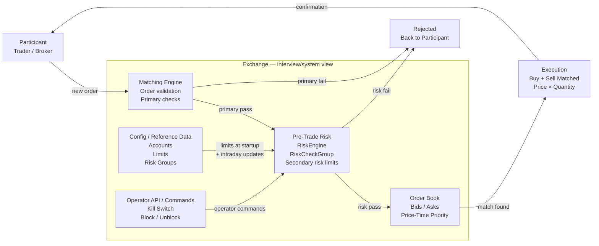

### 30-second narration

Participant sends an order. The matching-engine side performs its primary validation. If that passes, the order reaches pre-trade risk, where account/risk-group state is checked against limits such as position, notional-per-time and kill switch. A risk breach rejects the order immediately. If risk passes, the order proceeds to the order book, where price-time priority determines matching and execution. Configuration/reference-data updates feed the risk state, while operator commands can change controls such as a kill switch.

### Interview safety

Treat boxes such as a REST Operator API or a particular Config DB as an **interview/system design** unless your real PTR source material explicitly establishes those exact components.

---

## 2. 60–90 Second Class Diagram

Use this before coding. This is the smallest useful class-level picture.

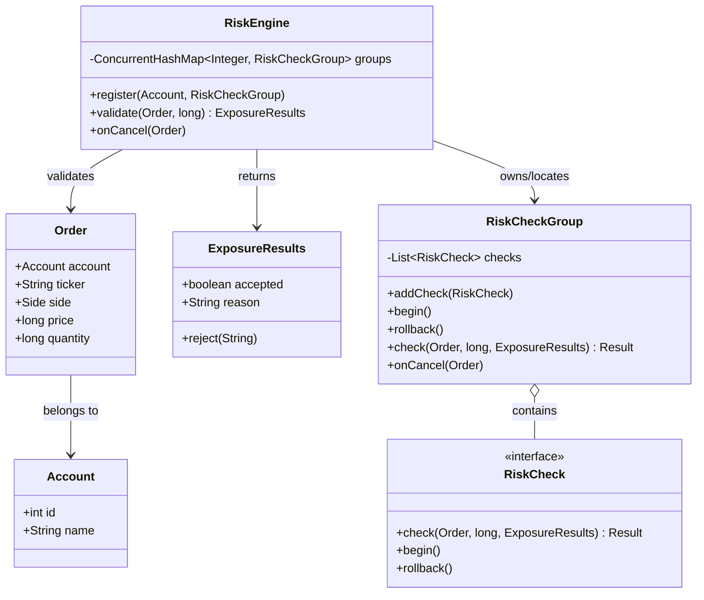

### One-line explanation

**RiskEngine orchestrates, RiskCheckGroup protects the group-level invariant, and individual RiskCheck implementations own individual risk rules.**

---

## 3. Detailed Class Diagram

Use this only when the interviewer asks how the checks are extended or how rollback works.

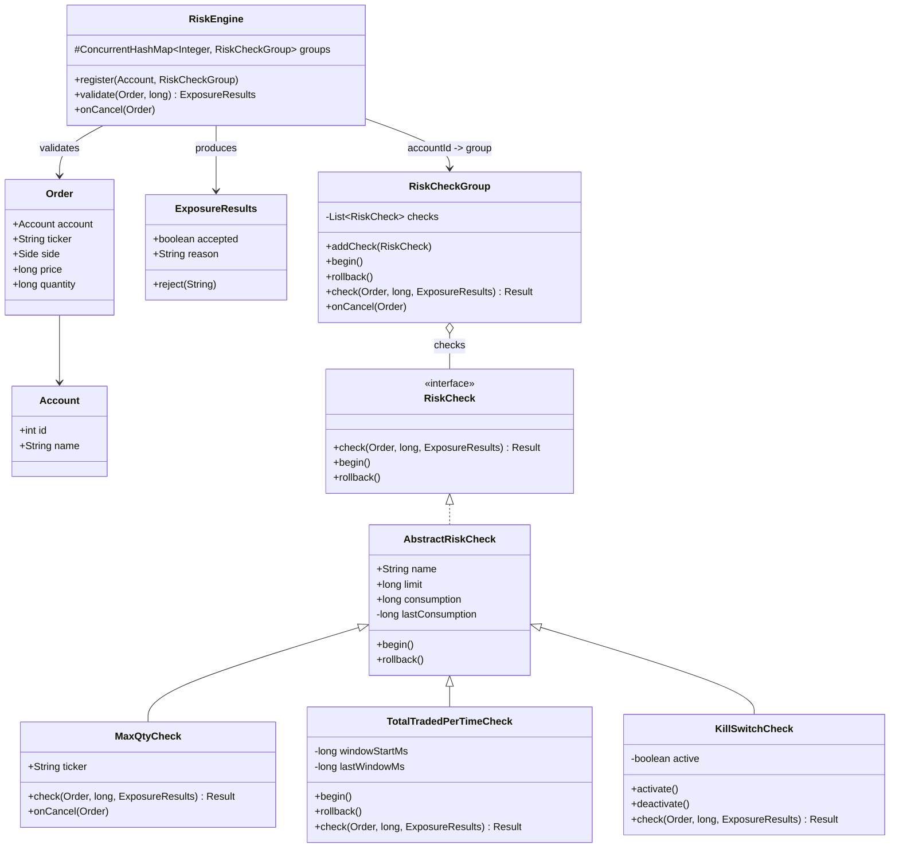

---

## 4. Risk Check Transaction / Rollback Flow

This diagram explains the `begin() -> check() -> rollback()` design.

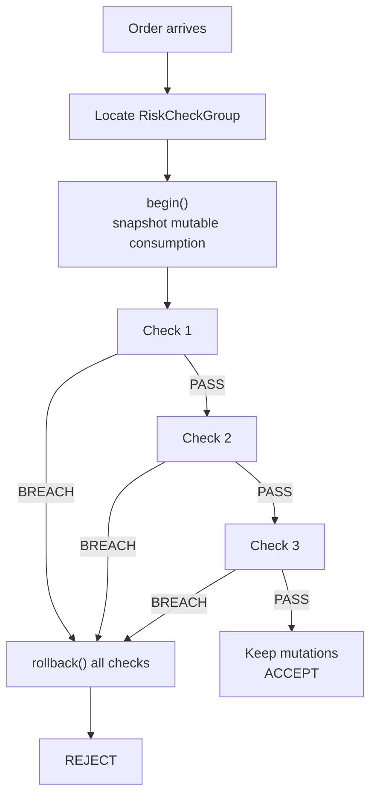

### Invariant

A risk decision behaves like one logical transaction:

```text
snapshot
→ evaluate checks
→ if every check passes, keep state
→ if any check breaches, restore prior state
```

An even simpler interview MVP is:

```text
calculate candidate values
→ validate all candidates
→ commit only after every validation passes
```

The second version is easier to write; the first version maps more closely to the attached class design.

---

## 5. Level 1 — Direct Concurrent Risk Engine

Maps to `RiskLimitEngine.java`.

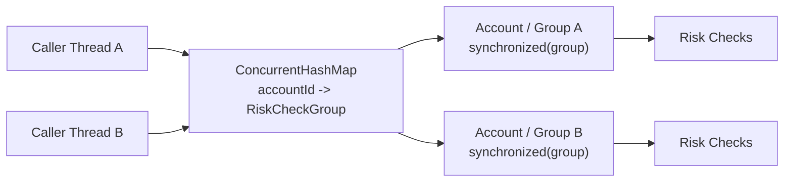

### Concurrency statement

Different account groups may be processed concurrently. Mutations inside the same `RiskCheckGroup` are serialized.

---

## 6. Level 2 — Synchronous Message-Bus Integration

Maps to `RiskLimitEngineAsync.java`.

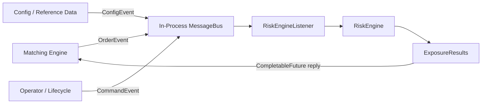

### Important

The attached implementation's bus dispatch is **synchronous**. `CompletableFuture` carries the response but does not itself create asynchronous execution.

---

## 7. Level 3a — Partitioned Direct Calls

Maps to `RiskLimitEnginePartitioned.java`.

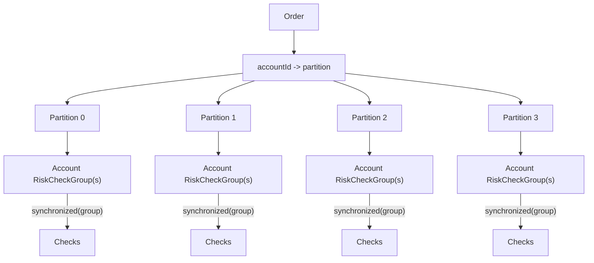

### Important

This partitions **state lookup/ownership organization**, but the current implementation still executes on caller threads and still locks each `RiskCheckGroup`.

---

## 8. Level 3b — Partitioned Event-Loop Design

This is the intended model behind `RiskLimitEnginePartitionedAsync.java`.

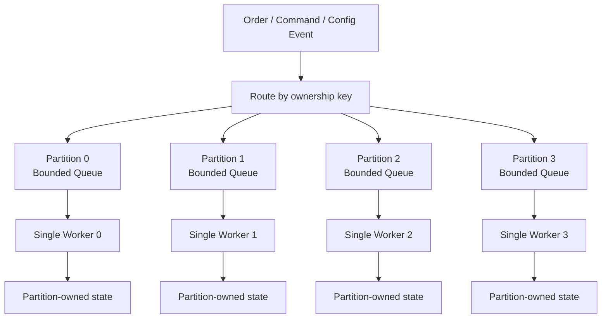

### Desired invariant

**Every mutation of state owned by a partition must enter through that same partition queue.**

That includes, when applicable:

- orders
- cancels
- limit/config updates
- kill-switch changes

Only then is the statement "one worker owns mutable partition state" fully true.

---

## 9. Concurrency Evolution — Interview Whiteboard

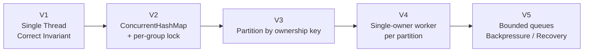

Say:

> "I would first make the business invariant correct. Then I would choose the concurrency model based on measured contention and the ownership boundary."

---

## 10. Matching Engine — Class / Data Structure Diagram

Maps to `MatchingEngine.java`.

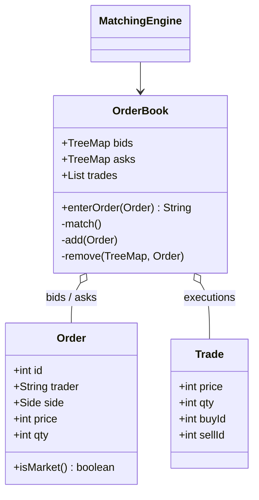

### Price-time structure

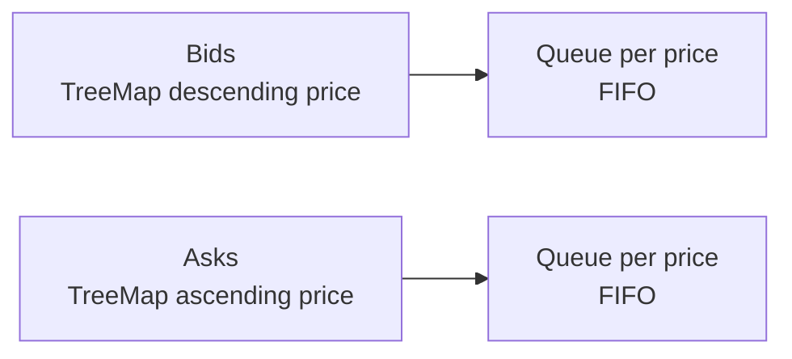

---

# What to Draw Live

Do not draw every diagram.

Use this sequence:

```text
1. End-to-end flow                     60–90 sec
2. Compact RiskEngine class diagram    60–90 sec
3. Start coding
4. Detailed inheritance/partitioning only if interviewer drills
```

The first two diagrams are the default interview pair.
