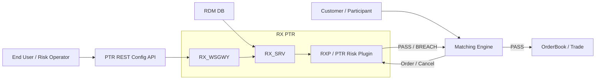
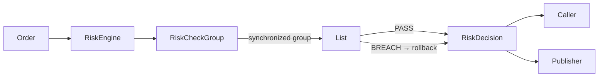
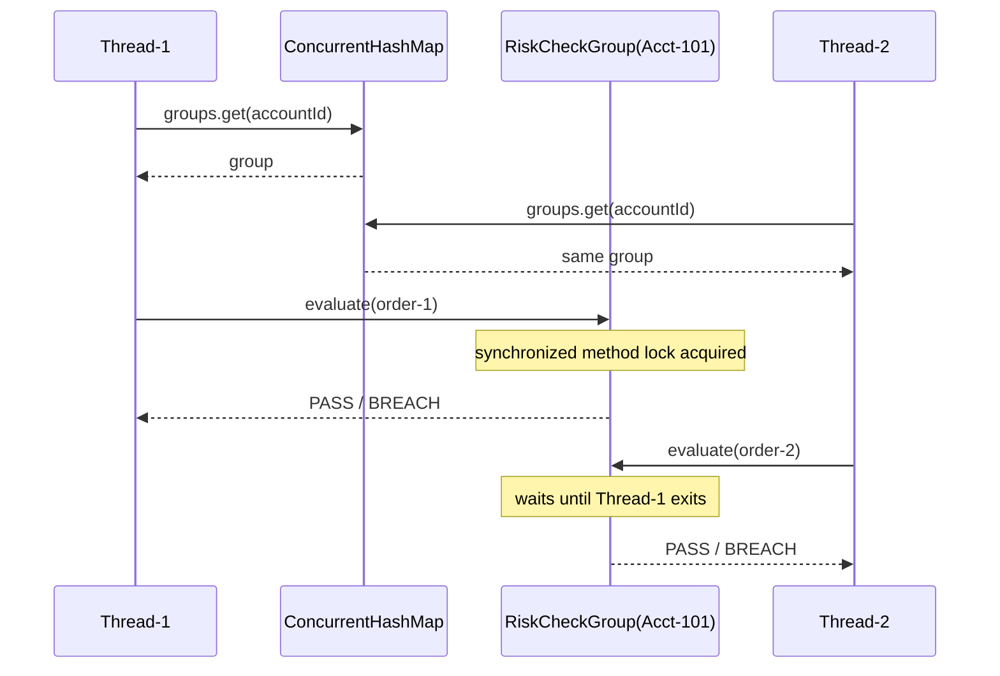
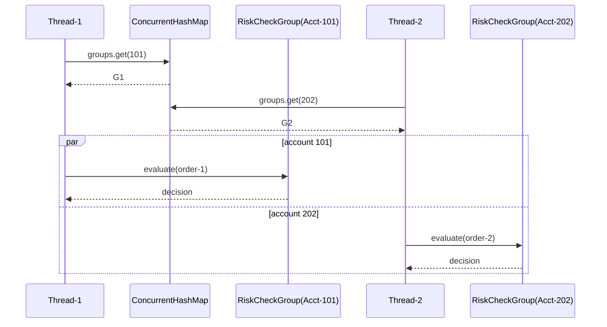
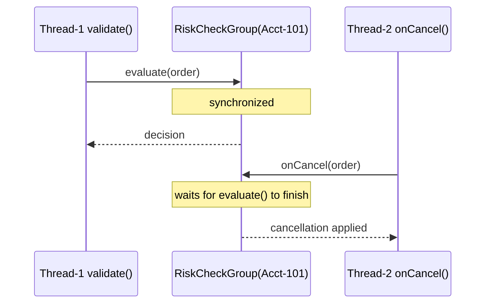
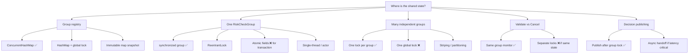
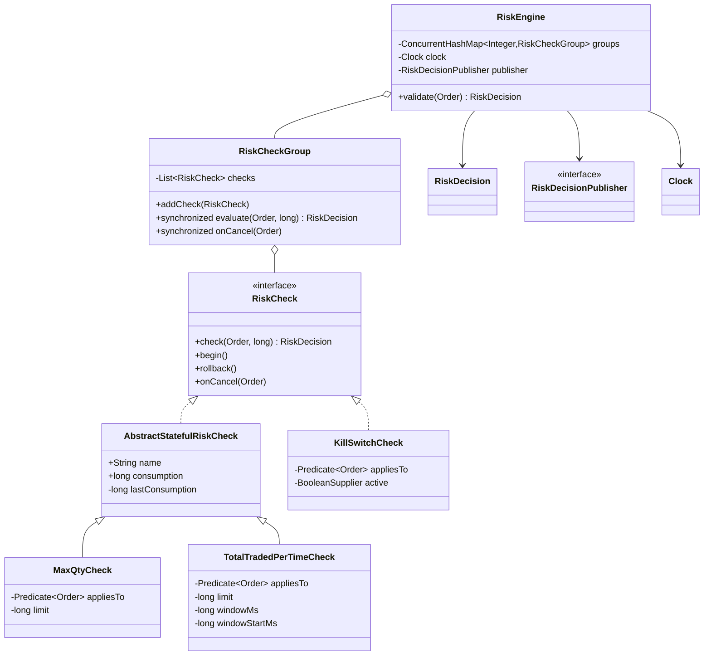

# Risk Engine — 1-Hour Interview Version

This is the **active interview file**.

Goal:

```text
understand in 5–10 min
hand-code core in 25–35 min
use remaining time for tests + follow-ups
```

Do not try to reproduce the full deep-dive framework unless the interviewer explicitly asks.


Pruning rule:

```text
KEEP
→ small additions that demonstrate an interview concept

REMOVE FROM ACTIVE CODE
→ additions that create a new subsystem, numeric model,
  ownership model or large dependency graph
```

So this file intentionally keeps `ConcurrentHashMap`, synchronized group methods,
`Clock`, publisher injection, `Predicate<Order>`, `TotalTradedPerTimeCheck`,
a stateless `KillSwitchCheck`, cancellation, and two differently scoped
`MaxQtyCheck` instances. These are still compact while demonstrating concurrency,
transactional rollback, DI, OCP and composition.


---

# 1. What to build in one hour

```text
MUST CODE
Account
Order
Result
RiskDecision
RiskCheck
AbstractStatefulRiskCheck
MaxQtyCheck
TotalTradedPerTimeCheck
KillSwitchCheck
RiskCheckGroup
RiskEngine

MUST EXPLAIN
Predicate<Order> + predicate composition
same rule with different scopes
Clock injection
publisher injection
ConcurrentHashMap vs synchronized(group)
group-level transaction
new-rule extension

ONLY IF ASKED
ExposureCheck
PriceDeviationCheck
BigDecimal
market-wide aggregation
multiple ownership domains
partitioning
RDM/config factory
```

Recommended timing:

```text
0–5     clarify invariant + draw high level
5–10    model + interfaces
10–20   MaxQtyCheck
20–30   RiskCheckGroup transaction
30–38   RiskEngine + Clock + publisher
38–45   KillSwitchCheck + predicate scope
45–52   tests / dry run
52–60   verbal follow-ups: concurrency / scale / new rule
```

---

# 2. Mermaid — high-level PTR / exchange system



Interview narration:

```text
CONTROL
End User
→ PTR REST Config API
→ RX services
← RDM DB
→ in-memory risk state

HOT PATH
Customer
→ Matching Engine
↔ PTR Risk Plugin
→ PASS   → OrderBook
→ BREACH → reject
```

Keep one sentence:

> **The hot path is synchronous and in memory; configuration/persistence is a separate control-plane concern.**

---

# 3. Mermaid — low-level request flow



Core invariant:

```text
begin snapshots
→ run checks
→ first BREACH
   → rollback all
→ all PASS
   → keep state
```

Concurrency:

> **`ConcurrentHashMap` makes group lookup safe across threads; `synchronized` on the `RiskCheckGroup` protects the whole state transition: snapshot → checks → rollback/keep. Individual `consumption` fields therefore do not need `AtomicLong`.**

---


# 3.1 Mermaid — concurrency timelines / thread flow

These are **clarity diagrams**, not extra implementation requirements.

## Same account / same RiskCheckGroup



Meaning:

```text
ConcurrentHashMap
→ both threads can safely find the group

same RiskCheckGroup
→ one thread enters evaluate()
→ other thread waits

therefore
→ one account/group state transition is serialized
→ no race on consumption / rollback state
```

## Different accounts / different groups



Meaning:

```text
different group objects
→ different monitors
→ can proceed in parallel
```

## Validate vs Cancel on same group



Meaning:

```text
validate()
and
onCancel()
share the same group monitor

therefore
→ they cannot corrupt the same group's state concurrently
```

## The shortest concurrency sentence

> **ConcurrentHashMap protects group lookup; synchronized `RiskCheckGroup` methods protect the compound business transaction for one group.**

## Multithreading decision tree — options and trade-offs

Use this when the interviewer asks **“why this concurrency design?”**



### Branch 1 — group lookup / registration

| Option | Good | Cost / trap | Interview choice |
|---|---|---|---|
| `ConcurrentHashMap` | Concurrent lookup/update; simple atomic map operations | Does **not** protect mutable state inside `RiskCheckGroup` | **Use** |
| `HashMap + synchronized` | Very simple correctness | One global lock can serialize unrelated accounts | Usually avoid |
| `Collections.synchronizedMap` | Individual map methods safe | Compound operations still need external locking; coarse locking | No advantage here |
| Immutable map + atomic swap | Excellent read-heavy config snapshots | More config/version/state-migration design | Follow-up only |

Key distinction:

```text
ConcurrentHashMap
→ protects the registry

RiskCheckGroup lock
→ protects the risk state
```

`ConcurrentHashMap` does **not** make this safe by itself:

```text
read consumption
→ calculate candidate
→ mutate several checks
→ maybe rollback
```

---

### Branch 2 — multiple threads hit the SAME group

#### Option A — `synchronized` method ✅ chosen

```java
synchronized RiskDecision evaluate(...) {
    ...
}
```

Why:

```text
smallest code
reentrant
automatic unlock
memory visibility
protects the whole transaction
```

Trade-off:

```text
one slow order
→ next order for same group waits
```

That is acceptable when the **business invariant itself is shared**.

#### Option B — explicit `synchronized(group)`

```java
synchronized (group) {
    group.evaluate(...);
}
```

Same underlying monitor, but worse ownership if callers must remember to lock.

```text
method synchronization
→ lock lives with the state owner ✅

caller synchronization
→ caller must know internals
→ easier to forget ❌
```

#### Option C — `ReentrantLock`

Useful when you actually need:

```text
tryLock()
timeout
lockInterruptibly()
fairness policy
multiple Condition objects
```

Cost:

```text
more code
must unlock in finally
more failure surface
```

For this interview:

```text
no special lock feature required
→ synchronized is easier
```

#### Option D — `AtomicLong` / CAS on each field ❌

Good for:

```text
one independent counter
```

Not enough for:

```text
snapshot check A
snapshot check B
mutate A
mutate B
breach
rollback A + B
```

The invariant spans **multiple objects and multiple operations**.

> **Atomic field ≠ atomic business transaction.**

#### Option E — `ReadWriteLock` / `StampedLock`

Poor fit for `evaluate()` because validation **mutates** risk state.

```text
most operations are writes
→ little read-lock benefit
→ more complexity
```

Could help only if the system had genuinely frequent read-only queries over the same state.

#### Option F — single-thread / actor / event-loop owner

```text
all events for one account/group
→ routed to one owner thread
→ no group lock required
```

Benefits:

```text
deterministic ordering
no lock contention inside owner
simple mutable state
```

Costs:

```text
queueing latency
routing/partitioning complexity
backpressure
owner-thread failure/recovery
```

Excellent production follow-up; too much architecture for the one-hour coding version.

---

### Branch 3 — threads hit DIFFERENT groups

Current design:

```text
Thread-1 → Group-101 monitor
Thread-2 → Group-202 monitor

different monitors
→ parallel execution
```

Alternatives:

```text
ONE GLOBAL LOCK
+ easiest mental model
- unrelated accounts block each other
- poor scalability

ONE LOCK PER GROUP ✅
+ contention isolated to shared business state
+ unrelated groups parallel
- many group objects / locks

LOCK STRIPING
+ fewer lock objects
- unrelated groups sharing stripe can block
- harder ownership reasoning

PARTITIONED SINGLE-THREAD OWNERS
+ deterministic + scalable by shard
- routing and queue architecture required
```

For the interview:

> **Lock at the smallest ownership boundary that still protects the full invariant.**

---

### Branch 4 — `validate()` races with `onCancel()`

Both mutate the **same check state**, therefore both use the same group monitor:

```text
evaluate()
    synchronized

onCancel()
    synchronized
```

Correct:

```text
validate ─────┐
              ├→ same monitor → serialized
cancel   ─────┘
```

Dangerous:

```text
validate → lock A
cancel   → lock B

same mutable state
→ different locks
→ race still exists
```

If a future operation needs to atomically change **multiple groups**, then one per-group lock is no longer automatically enough.

Follow-up choices:

```text
deterministic lock ordering
→ lock groups in stable ID order

OR

route multi-group operation
→ one higher-level owner / partition
```

This avoids deadlock from:

```text
Thread-1 locks A → waits B
Thread-2 locks B → waits A
```

---

### Branch 5 — `TotalTradedPerTimeCheck`

These fields form one invariant:

```text
windowStartMs
consumption
```

They must change together:

```text
window expired?
→ reset windowStartMs
→ reset consumption
→ calculate traded value
→ add
→ maybe rollback both
```

Therefore:

```text
same RiskCheckGroup synchronized transaction ✅
```

is better than:

```text
AtomicLong windowStartMs
AtomicLong consumption

because
→ each field may be atomic
→ pair is still not one atomic state transition
```

---

### Branch 6 — publisher and lock duration

Current flow:

```text
group.evaluate()
→ synchronized work ends
→ lock released
→ publisher.publish(...)
```

This is intentional.

Do **not** keep the group lock while doing possible external I/O:

```text
BAD
group lock
→ risk checks
→ network / broker publish
→ release lock

one slow broker call
→ blocks next order for that group
```

Trade-off:

```text
SYNCHRONOUS PUBLISH
+ simplest
+ immediate failure visible
- adds caller latency

ASYNC HANDOFF
+ bus/network latency off risk path
+ group lock already released
- queue/backpressure/failure semantics
- delivery ordering/durability need design
```

For one interview:

> **Make the risk decision under the group lock; perform unrelated external work after releasing it.**

---

## Concurrency choice summary

```text
REGISTRY
→ ConcurrentHashMap

ONE GROUP'S MUTABLE STATE
→ synchronized RiskCheckGroup

DIFFERENT GROUPS
→ independent monitors → parallel

VALIDATE + CANCEL
→ same monitor

INDIVIDUAL ATOMICS
→ not enough for multi-check rollback

REENTRANTLOCK
→ only if special lock features are needed

ACTOR / PARTITION OWNER
→ strong scaling follow-up, not one-hour code

PUBLISHER
→ outside group lock
```

The reusable principle:

> **Choose the concurrency primitive from the invariant, not from the field type.**

---

# 4. Mermaid — class-level design



Why interface + abstract class:

```text
RiskCheck
→ universal rule contract

AbstractStatefulRiskCheck
→ optional snapshot / rollback implementation

MaxQtyCheck
→ stateful quantity

TotalTradedPerTimeCheck
→ stateful fixed-window traded value

KillSwitchCheck
→ stateless
```

---

### Why keep two `MaxQtyCheck` instances?

The extra instance is intentional and cheap:

```text
AAPL BUY limit
TECH SELL limit
```

Both use the same `MaxQtyCheck`; only the injected `Predicate<Order>` and limit change.
That demonstrates extensibility more effectively than adding another large rule class.

A true **net/open-position** rule changes arithmetic (`BUY +`, `SELL -`), so keep that as
a verbal `ExposureCheck`/`PositionCheck` follow-up rather than bloating this one-hour code.

---

# 5. Complete Java — one-hour hand-code target

```java
import java.time.Clock;
import java.time.Instant;
import java.util.ArrayList;
import java.util.List;
import java.util.Set;
import java.util.concurrent.ConcurrentHashMap;
import java.util.function.BooleanSupplier;
import java.util.function.Predicate;

enum Side {
    Buy,
    Sell
}

enum Result {
    PASS,
    BREACH
}

class Account {

    final int id;
    final String name;

    Account(int id, String name) {
        this.id = id;
        this.name = name;
    }
}

class Order {

    final String orderId;
    final Account account;
    final String ticker;
    final Side side;
    final long price;
    final long quantity;
    final Instant eventTime;

    Order(
            String orderId,
            Account account,
            String ticker,
            Side side,
            long price,
            long quantity,
            Instant eventTime) {

        this.orderId = orderId;
        this.account = account;
        this.ticker = ticker;
        this.side = side;
        this.price = price;
        this.quantity = quantity;
        this.eventTime = eventTime;
    }
}

record RiskDecision(
        Result result,
        String checkName,
        String reason) {

    static RiskDecision pass() {
        return new RiskDecision(
                Result.PASS,
                "NONE",
                "OK");
    }

    static RiskDecision breach(
            String checkName,
            String reason) {

        return new RiskDecision(
                Result.BREACH,
                checkName,
                reason);
    }

    boolean accepted() {
        return result == Result.PASS;
    }
}

@FunctionalInterface
interface RiskDecisionPublisher {

    void publish(
            Order order,
            RiskDecision decision,
            long decidedAtMs);
}

interface RiskCheck {

    RiskDecision check(
            Order order,
            long nowMs);

    default void begin() {
    }

    default void rollback() {
    }

    default void onCancel(
            Order order) {
    }
}

abstract class AbstractStatefulRiskCheck
        implements RiskCheck {

    final String name;
    long consumption;

    private long lastConsumption;

    AbstractStatefulRiskCheck(
            String name) {

        this.name = name;
    }

    @Override
    public void begin() {
        lastConsumption = consumption;
    }

    @Override
    public void rollback() {
        consumption = lastConsumption;
    }
}

class MaxQtyCheck
        extends AbstractStatefulRiskCheck {

    private final
    Predicate<Order> appliesTo;

    private final long limit;

    MaxQtyCheck(
            String name,
            Predicate<Order> appliesTo,
            long limit) {

        super(name);

        this.appliesTo = appliesTo;
        this.limit = limit;
    }

    @Override
    public RiskDecision check(
            Order order,
            long nowMs) {

        if (!appliesTo.test(order)) {
            return RiskDecision.pass();
        }

        long candidate =
                Math.addExact(
                        consumption,
                        order.quantity);

        if (candidate > limit) {

            return RiskDecision.breach(
                    name,
                    "MAX QTY BREACH");
        }

        consumption = candidate;
        return RiskDecision.pass();
    }

    @Override
    public void onCancel(
            Order order) {

        if (!appliesTo.test(order)) {
            return;
        }

        consumption =
                Math.max(
                        0,
                        consumption - order.quantity);
    }
}

/*
 * Accumulated traded value in a fixed processing-time window.
 *
 * Example:
 * limit = 50,000,000
 * windowMs = 1,000
 *
 * Every matching order contributes:
 *     price * quantity
 *
 * When the window expires:
 *     reset consumption to zero.
 */
class TotalTradedPerTimeCheck
        extends AbstractStatefulRiskCheck {

    private final
    Predicate<Order> appliesTo;

    private final long limit;
    private final long windowMs;

    private long windowStartMs = -1L;
    private long lastWindowStartMs;

    TotalTradedPerTimeCheck(
            String name,
            Predicate<Order> appliesTo,
            long limit,
            long windowMs) {

        super(name);

        this.appliesTo = appliesTo;
        this.limit = limit;
        this.windowMs = windowMs;
    }

    @Override
    public void begin() {
        super.begin();
        lastWindowStartMs =
                windowStartMs;
    }

    @Override
    public void rollback() {
        super.rollback();
        windowStartMs =
                lastWindowStartMs;
    }

    @Override
    public RiskDecision check(
            Order order,
            long nowMs) {

        if (!appliesTo.test(order)) {
            return RiskDecision.pass();
        }

        if (windowStartMs < 0
                || nowMs - windowStartMs
                >= windowMs) {

            windowStartMs = nowMs;
            consumption = 0;
        }

        long tradedValue =
                Math.multiplyExact(
                        order.price,
                        order.quantity);

        long candidate =
                Math.addExact(
                        consumption,
                        tradedValue);

        if (candidate > limit) {

            return RiskDecision.breach(
                    name,
                    "TOTAL TRADED PER TIME BREACH");
        }

        consumption = candidate;
        return RiskDecision.pass();
    }
}

/*
 * Stateless rule:
 * shows why RiskCheck interface is useful even when a rule
 * does not need AbstractStatefulRiskCheck.
 */
class KillSwitchCheck
        implements RiskCheck {

    private final String name;

    private final
    Predicate<Order> appliesTo;

    private final
    BooleanSupplier active;

    KillSwitchCheck(
            String name,
            Predicate<Order> appliesTo,
            BooleanSupplier active) {

        this.name = name;
        this.appliesTo = appliesTo;
        this.active = active;
    }

    @Override
    public RiskDecision check(
            Order order,
            long nowMs) {

        if (appliesTo.test(order)
                && active.getAsBoolean()) {

            return RiskDecision.breach(
                    name,
                    "KILL SWITCH ACTIVE");
        }

        return RiskDecision.pass();
    }
}

/*
 * Concurrency boundary:
 * one RiskCheckGroup monitor protects the whole
 * begin -> checks -> rollback/keep transaction.
 *
 * ConcurrentHashMap protects group lookup.
 * synchronized(group) semantics are implemented by
 * synchronized evaluate()/onCancel().
 */
class RiskCheckGroup {

    private final List<RiskCheck> checks =
            new ArrayList<>();

    void addCheck(
            RiskCheck check) {

        checks.add(check);
    }

    synchronized RiskDecision evaluate(
            Order order,
            long nowMs) {

        checks.forEach(
                RiskCheck::begin);

        try {

            for (RiskCheck check : checks) {

                RiskDecision decision =
                        check.check(
                                order,
                                nowMs);

                if (!decision.accepted()) {

                    checks.forEach(
                            RiskCheck::rollback);

                    return decision;
                }
            }

            return RiskDecision.pass();

        } catch (RuntimeException e) {

            checks.forEach(
                    RiskCheck::rollback);

            throw e;
        }
    }

    synchronized void onCancel(
            Order order) {

        checks.forEach(
                check ->
                        check.onCancel(order));
    }
}

class RiskEngine {

    private final
    ConcurrentHashMap<Integer, RiskCheckGroup> groups =
            new ConcurrentHashMap<>();

    private final Clock clock;

    private final
    RiskDecisionPublisher publisher;

    RiskEngine(
            Clock clock,
            RiskDecisionPublisher publisher) {

        this.clock = clock;
        this.publisher = publisher;
    }

    void register(
            Account account,
            RiskCheckGroup group) {

        groups.put(
                account.id,
                group);
    }

    RiskDecision validate(
            Order order) {

        long nowMs =
                clock.millis();

        RiskCheckGroup group =
                groups.get(
                        order.account.id);

        RiskDecision decision;

        if (group == null) {

            decision =
                    RiskDecision.breach(
                            "RiskEngine",
                            "NO RISK GROUP");

        } else {

            /*
             * evaluate() is synchronized on this RiskCheckGroup.
             * It owns begin -> checks -> rollback/keep atomically.
             */
            decision =
                    group.evaluate(
                            order,
                            nowMs);
        }

        publisher.publish(
                order,
                decision,
                nowMs);

        return decision;
    }

    void onCancel(
            Order order) {

        RiskCheckGroup group =
                groups.get(
                        order.account.id);

        if (group != null) {
            group.onCancel(order);
        }
    }
}

public class RiskEngineOneHour {

    public static void main(String[] args) {

        Account account =
                new Account(
                        1,
                        "CLIENT-1");

        Predicate<Order> aaplBuys =
                order ->
                        order.side == Side.Buy
                        && order.ticker.equals("AAPL");

        Set<String> techTickers =
                Set.of(
                        "AAPL",
                        "MSFT",
                        "GOOG");

        Predicate<Order> techSells =
                order ->
                        order.side == Side.Sell
                        && techTickers.contains(
                                order.ticker);

        Predicate<Order> allOrders =
                order -> true;

        boolean[] killSwitch =
                {false};

        RiskCheckGroup group =
                new RiskCheckGroup();

        group.addCheck(
                new MaxQtyCheck(
                        "AAPL-BUY-QTY",
                        aaplBuys,
                        1_000));

        /*
         * Tiny extra example:
         * same MaxQtyCheck class, different injected scope.
         */
        group.addCheck(
                new MaxQtyCheck(
                        "TECH-SELL-QTY",
                        techSells,
                        5_000));

        group.addCheck(
                new TotalTradedPerTimeCheck(
                        "VALUE-PER-SECOND",
                        allOrders,
                        50_000_000,
                        1_000L));

        group.addCheck(
                new KillSwitchCheck(
                        "KILL-SWITCH",
                        allOrders,
                        () -> killSwitch[0]));

        RiskDecisionPublisher publisher =
                (order, decision, time) ->
                        System.out.println(
                                order.orderId
                                        + " -> "
                                        + decision);

        RiskEngine engine =
                new RiskEngine(
                        Clock.systemUTC(),
                        publisher);

        engine.register(
                account,
                group);

        Order order =
                new Order(
                        "ORD-1",
                        account,
                        "AAPL",
                        Side.Buy,
                        200,
                        100,
                        Instant.now());

        System.out.println(
                engine.validate(order));
    }
}
```

The code above was compile-verified with `javac`.

---

# 6. What to say while coding

```text
“I’ll make one rule correct first, then compose multiple rules.”

“ConcurrentHashMap protects the map, not the compound risk transaction.”

“ConcurrentHashMap protects group lookup; the synchronized group protects the compound business transaction across all checks.”

“The rule and its applicability scope are separate concerns; I inject the scope as Predicate<Order>.”

“Clock is injected so processing time is consistent and tests can be deterministic.”

“RiskDecision is domain data; RiskDecisionPublisher is an infrastructure port.”

“A new check implements RiskCheck and is added to the group; RiskEngine does not change.”
```


Extra concurrency line:

```text
“If two threads hit the same account, ConcurrentHashMap lookup is concurrent but the same RiskCheckGroup serializes evaluation. If they hit different accounts mapped to different groups, they can proceed in parallel.”
```

---

# 7. The five follow-ups to be ready for

## Total traded per time

```text
fixed window:
window expires
→ reset consumption
→ add price × quantity
→ breach if candidate > limit

exact rolling window follow-up:
Deque<(timestamp, value)>
→ evict older than now - window
→ maintain running sum
```


## Add a new rule

```text
new class implements RiskCheck
→ group.addCheck(...)
→ RiskEngine unchanged
```

Example:

```text
PriceDeviationCheck
→ inject ReferencePriceProvider
```

## Apply same rule to another scope

```java
Predicate<Order> msftSells =
        order ->
                order.side == Side.Sell
                && order.ticker.equals("MSFT");
```

No `MaxQtyCheck` change.

## Multiple tickers / market segment

```text
Predicate<Order>
→ set membership
→ market-segment match
→ compose with .and(...)
```

## Money

```text
this interview code
→ long for simplicity / explicit ticks assumption

production financial semantics
→ BigDecimal or explicit fixed-point/ticks
→ never accidental double
```

## More throughput

```text
current one-hour code
→ one mutation owner / single-threaded group

if concurrent callers are required
→ protect the whole group transaction
   OR partition by ownership key

scale
→ keep one invariant under one lock/owner
```

---

# 8. Stop line

For this interview, if you can reconstruct:

```text
RiskCheck
→ MaxQtyCheck
→ RiskCheckGroup
→ RiskEngine
```

and explain:

```text
Predicate
Clock
publisher
ConcurrentHashMap vs synchronized(group)
group-level transaction
new-rule extension
```

you have enough.

The full deep-dive file exists for later rounds; do not turn this one-hour version back into the full framework.
