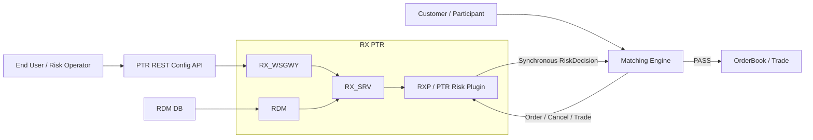
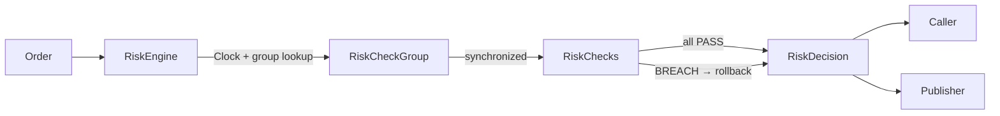
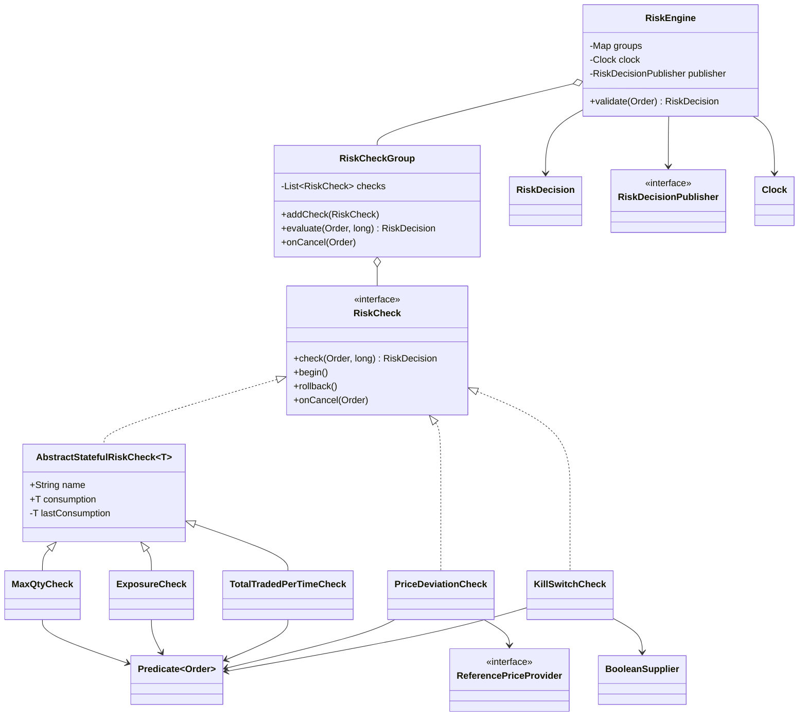

# Risk Engine — Deep-Dive Learning Appendix

This file preserves the detailed design discussion that is intentionally **not required for the one-interview revision path**.

Use:

```text
POINT72_TREASURY_TOMORROW_MORNING_STUDY_ORDER.md
→ interview core / retrieval

RISK_ENGINE_DEEP_DIVE_LEARNING.md
→ full reasoning / follow-ups / future interviews

RiskEngineExtensible.java
→ canonical compile-verified implementation
```

---

# 1. Final mental model

```text
DOMAIN
Account / Order

RULE CONTRACT
RiskCheck

OPTIONAL SHARED STATEFUL BEHAVIOR
AbstractStatefulRiskCheck<T>

APPLICABILITY
Predicate<Order>

COMPOSITION + BUSINESS TRANSACTION + LOCK
RiskCheckGroup

ENGINE
RiskEngine

INJECTED INFRASTRUCTURE
Clock
RiskDecisionPublisher
ReferencePriceProvider
BooleanSupplier

OUTPUT
RiskDecision
```

Core design sentence:

> **The risk rule and the scope to which it applies are separate concerns.**

---

# 2. Why only `Result` + `RiskDecision`

Earlier versions used:

```text
Result
+
ExposureResults
+
RiskDecision
```

That became redundant.

Final model:

```text
Result
→ tiny status enum: PASS / BREACH

RiskDecision
→ complete immutable domain decision
→ result
→ order/account/ticker
→ breached check
→ reason
→ decision time
```

`ExposureResults` is no longer needed.

Why retain `Result` at all?

```text
Result.PASS / Result.BREACH
```

communicates domain state more clearly than a bare boolean and can later evolve to another explicit state if the contract requires it.

---

# 3. Why `RiskDecision` and `RiskDecisionPublisher` are separate

```text
RiskDecision
= what happened

RiskDecisionPublisher
= how/where that decision is sent
```

The same decision can be:

```text
returned to the synchronous caller
logged
audited
published to a bus
captured by a test fake
ignored by a no-op publisher
```

A domain object should not know Kafka/message-bus connection details.

```java
interface RiskDecisionPublisher {
    void publish(RiskDecision decision);
}
```

Production can inject a bus adapter; tests can inject an in-memory lambda.

For a latency-sensitive path, the publisher should normally hand off asynchronously if broker latency must remain off the synchronous risk decision path.

---

# 4. Why `RiskCheck` interface + abstract class

They solve different problems.

```text
RiskCheck
→ WHAT every rule can do
→ universal contract

AbstractStatefulRiskCheck<T>
→ HOW stateful rules reuse snapshot / rollback
→ optional implementation
```

Stateful examples:

```text
MaxQtyCheck
ExposureCheck
TotalTradedPerTimeCheck
```

Stateless / externally backed examples:

```text
PriceDeviationCheck
KillSwitchCheck
```

This prevents meaningless `limit` / `consumption` fields from being forced into rules that do not need them.

---

# 5. `consumption` ownership and lifetime

Every risk-check object owns its own instance field.

Conceptually:

```text
MaxQty[AAPL] object
→ consumption = 600

MaxQty[MSFT] object
→ consumption = 1200

Exposure object
→ consumption = monetary net exposure

Time-window object
→ consumption = current-window traded value
```

Why does it survive multiple calls?

```text
ConcurrentHashMap
→ retains same RiskCheckGroup object
→ group retains same RiskCheck objects
→ objects retain their instance state
```

Therefore:

```text
validate(order 1)
→ accepted state changes

validate(order 2)
→ same objects
→ sees previous accepted state
```

Process restart:

```text
heap disappears
→ state disappears
→ startup / recovery must rebuild required state
```

That connects directly to the PTR readiness/startup incident.

---

# 6. Does `consumption` need `AtomicLong` / concurrent state?

Not in this design.

```java
synchronized RiskDecision evaluate(...)
```

makes the **group** the atomic business boundary.

Inside that monitor:

```text
snapshot all state
→ run multiple checks
→ provisional mutations
→ first breach?
   → rollback all
→ otherwise keep accepted state
```

`synchronized` provides:

```text
mutual exclusion
+
memory visibility
```

An `AtomicLong` would only make one numeric field atomic; it would not make the multi-check business transaction atomic.

Critical ownership rule:

> **Never share the same mutable RiskCheck instance between independently locked groups.**

Otherwise two different locks could protect the same mutable object incorrectly.

---

# 7. Why `name` exists

`name` is diagnostic metadata.

Useful for:

```text
logs
breach reason
audit
toString()
configuration identity
```

It is not part of correctness.

A stronger production representation could use:

```text
typed check ID
configuration ID
```

rather than an arbitrary display string.

---

# 8. Constructor injection / composition root

Injection happens when objects are built.

```text
RiskEngine
← Clock
← RiskDecisionPublisher

PriceDeviationCheck
← ReferencePriceProvider

KillSwitchCheck
← BooleanSupplier

risk rules
← Predicate<Order>
```

The bottom `main()` in `RiskEngineExtensible.java` acts as the composition root.

In Spring, the same wiring could move into:

```text
@Configuration
factory
bean construction
configuration loader
```

The risk-domain classes themselves do not require Spring annotations to support constructor injection.

---

# 9. Injecting behavior with `Predicate<Order>`

Instead of hard-coding:

```text
BUY + AAPL
```

inside `MaxQtyCheck`, inject applicability.

Examples:

```java
Predicate<Order> aaplBuys =
        Scopes.ticker("AAPL")
                .and(Scopes.side(Side.Buy));
```

```java
Predicate<Order> techSells =
        Scopes.tickers(techTickers)
                .and(Scopes.side(Side.Sell));
```

```java
Predicate<Order> cash =
        Scopes.marketSegment("CASH");
```

```java
Predicate<Order> all =
        Scopes.all();
```

This lets the same rule implementation apply to:

```text
one ticker
ticker collection
BUY only
SELL only
market segment
whole group
combined scope
```

The caller/configuration layer decides scope; the rule decides arithmetic.

---

# 10. Predicate vs Supplier vs Consumer vs Function

Use functional interfaces by meaning.

```text
Predicate<Order>
→ does this rule apply?

BooleanSupplier
→ is kill switch active?

ReferencePriceProvider
→ domain-specific Function-like dependency
→ given order, resolve reference price

RiskDecisionPublisher
→ domain-specific Consumer-like dependency
→ publish decision
```

Could `Consumer<RiskDecision>` technically replace the publisher?

Yes.

But:

```text
RiskDecisionPublisher
```

communicates intent better than a generic `Consumer`.

Use generic functional interfaces when they make the domain clearer, not merely because they are available.

---

# 11. Max BUY / Max SELL / Max OPEN

Do not create class explosion for mere scope changes.

Same `MaxQtyCheck` can support:

```text
AAPL BUY
AAPL SELL
TECH BUY
TECH SELL
whole-market quantity
segment quantity
```

through injected predicates.

But distinguish fundamentally different arithmetic.

```text
Max BUY quantity
→ qualifying BUY adds positive quantity

Max SELL quantity
→ qualifying SELL adds positive quantity

Net/Open position
→ BUY adds
→ SELL subtracts
```

Net/open position belongs in a different rule such as `ExposureCheck` / `PositionCheck`.

---

# 12. One group can contain heterogeneous checks

Example:

```text
AAPL BUY quantity
MSFT quantity
whole-account exposure
CASH-segment value per second
price deviation
kill switch
```

All can sit inside one `RiskCheckGroup`.

The group itself is currently found through:

```text
accountId → RiskCheckGroup
```

So its ownership domain is the account in this sample.

A `Predicate<Order>` narrows which orders inside that ownership domain affect a rule.

Important distinction:

```text
account group + marketSegment predicate
≠ automatically a globally aggregated market-segment limit
```

A true market-wide limit across accounts requires a market-level ownership/group/partition design.

---

# 13. Risk scope can evolve beyond ticker

Possible applicability dimensions:

```text
ticker
ticker set
side
market segment
account
participant
desk
PTLG
venue
product family
risk group
```

If `Predicate<Order>` becomes too opaque/config-heavy, promote scope into a typed domain abstraction:

```java
interface OrderScope {
    boolean matches(Order order);
}
```

Then rules depend on `OrderScope` rather than raw strings or lambdas.

For one interview, `Predicate<Order>` is the lighter implementation.

---

# 14. Time: `Clock`, `nowMs`, and `Order.eventTime`

There are two distinct times.

```text
Order.eventTime
→ event/business timestamp

Clock.millis()
→ local processing timestamp
```

They are not automatically interchangeable.

Injecting `Clock` into `RiskEngine` gives:

```text
one processing time per validation
→ same value passed to every check
→ deterministic tests
→ callers do not supply engine time
```

Tests can use:

```java
Clock.fixed(...)
```

without sleeping.

Which timestamp drives a risk window is a business contract.

---

# 15. BigDecimal vs long / fixed point

Current extensible sample:

```text
quantity
→ long

price / exposure / traded value
→ BigDecimal
```

Why not `double`?

```text
binary floating point
→ unsuitable for exact decimal money semantics
```

For ordinary financial-domain services:

```text
BigDecimal
→ strong default
```

For a latency-sensitive exchange hot path:

```text
fixed-point long
integer ticks
integer minor units
```

may be preferable for predictable allocation/performance.

Senior answer:

> **Never use accidental floating-point money. Choose an explicit representation from the latency and precision contract.**

---

# 16. Why `Math.addExact` / `multiplyExact` mattered in the long version

Plain integer arithmetic silently wraps on overflow.

In risk code, overflow can turn a huge positive value negative and accidentally pass a limit.

Use:

```java
Math.addExact(...)
Math.multiplyExact(...)
Math.negateExact(...)
```

when using integer/fixed-point arithmetic and fail closed / surface a controlled validation error if overflow occurs.

With `BigDecimal`, integer overflow is not the same issue, but input/scale/precision contracts still matter.

---

# 17. PriceDeviationCheck

It demonstrates two extension principles:

```text
rule implementation
→ PriceDeviationCheck

scope
→ Predicate<Order>

external market data
→ ReferencePriceProvider
```

The rule does not know:

```text
database
REST
message bus
market-data cache implementation
```

It only knows:

```java
referencePriceProvider.referencePrice(order)
```

Basis-point comparison can avoid division/rounding through cross multiplication.

---

# 18. KillSwitchCheck

Kill-switch state is external to the rule:

```java
BooleanSupplier active;
```

Possible injected implementations:

```text
AtomicBoolean::get
configuration service accessor
shared command state accessor
test lambda
```

The rule remains unchanged.

---

# 19. OCP / change isolation

OCP does **not** mean arbitrary behavior changes require zero code.

It means each change has one local home and stable orchestration stays stable.

```text
CHANGE LIMIT
→ config / constructor value

CHANGE TICKER / SIDE / SEGMENT / TICKER SET
→ Predicate<Order>

CHANGE REFERENCE-PRICE SOURCE
→ ReferencePriceProvider

CHANGE BUS
→ RiskDecisionPublisher

CHANGE PROCESSING TIME SOURCE
→ Clock

CHANGE EXISTING RULE SEMANTICS
→ that concrete RiskCheck + tests

ADD NEW RISK RULE
→ new RiskCheck implementation
→ one addCheck(...) wiring line
```

Stable:

```text
RiskEngine
RiskCheckGroup
unrelated RiskCheck classes
```

Target rule:

> **Stable orchestration; replaceable rules; injected scope; injected infrastructure.**

---

# 20. RDM / REST configuration boundary

Production config flow:

```text
RDM DB / PTR REST configuration
→ configuration adapter / factory
→ typed constructor values
→ Predicate / scope
→ RiskCheck object
→ RiskCheckGroup
```

Do not make concrete risk rules parse:

```text
JSON
REST payloads
database rows
broker messages
```

That keeps transport/persistence formats outside the hot-path rule logic.

Example:

```java
Predicate<Order> scope =
        Scopes.tickers(configuredTickers)
                .and(Scopes.side(configuredSide));

RiskCheck check =
        new MaxQtyCheck(
                configuredName,
                scope,
                configuredLimit);
```

Changing data/config does not require changing the risk algorithm.

---

# 21. High-level PTR architecture



Interview-safe interpretation:

```text
CONTROL / CONFIG
End User
→ PTR REST Config API
→ RX control/services
← RDM / RDM DB
→ initialize/update in-memory risk state

HOT DATA PATH
Customer
→ Matching Engine
↔ RXP / PTR Risk Plugin
→ synchronous risk decision
```

Treat process arrows as a simplified interview map, not an assertion that every transport hop is identical across all PTR generations/deployments.

---

# 22. Low-level flow



Internal sequence:

```text
resolve group
→ lock group
→ snapshot stateful checks
→ run checks in order
→ first breach?
   → rollback
   → return breach
→ all pass
   → keep state
→ publish/return RiskDecision
```

---

# 23. Class-level design



---

# 24. New-feature examples

## New `MaxOrderValueCheck`

Only:

```text
1. implement RiskCheck
2. addCheck(...)
```

No `RiskEngine` switch.

## New scope: all derivatives

Only:

```java
Predicate<Order> derivatives =
        Scopes.marketSegment("DERIVATIVES");
```

## New bus

Only:

```text
new RiskDecisionPublisher implementation
```

## New market-data source

Only:

```text
new ReferencePriceProvider implementation
```

## New time-window duration

Only:

```text
constructor config
```

---

# 25. Production startup/readiness connection

Risk arithmetic can be locally correct while system state is globally incomplete.

PTR incident memory:

```text
DEFAULT PTLG intentionally deferred
→ readiness boundary reached too early
→ required RiskCheckContainer absent
→ recovered GTC increment skipped
→ configuration later exists
→ cancel decrements
→ negative exposure
```

Invariant:

> **Required risk state must exist before an order is allowed to affect exposure.**

This is why state reconstruction/readiness matters as much as individual rule arithmetic.

---

# 26. Exact interview follow-ups

```text
Why not AtomicLong?
→ group-level invariant spans multiple checks

Why interface + abstract class?
→ contract vs optional shared stateful behavior

How add a rule?
→ implement RiskCheck + addCheck

How change applicability?
→ inject Predicate<Order>

How handle multiple tickers?
→ Scopes.tickers(set)

How handle buy/sell?
→ predicate if same arithmetic;
  separate rule if arithmetic semantics differ

Why Clock?
→ deterministic testing + one processing timestamp

Why eventTime too?
→ event time and processing time are different contracts

Why BigDecimal?
→ decimal money semantics

Why might long still be better?
→ explicit fixed-point/ticks on latency-sensitive path

Why separate decision and publisher?
→ domain data vs infrastructure action

How publish to bus?
→ injected RiskDecisionPublisher; async handoff if required

How does state survive?
→ map retains group; group retains check objects

How scale?
→ partition independent ownership domains;
  do not add threads around shared mutable state casually
```

---

# 27. Canonical compile-verified Java

```java
import java.math.BigDecimal;
import java.time.Clock;
import java.time.Instant;
import java.util.ArrayList;
import java.util.List;
import java.util.Map;
import java.util.Objects;
import java.util.Set;
import java.util.concurrent.ConcurrentHashMap;
import java.util.concurrent.atomic.AtomicBoolean;
import java.util.function.BooleanSupplier;
import java.util.function.Predicate;

enum Side {
    Buy,
    Sell
}

enum Result {
    PASS,
    BREACH
}

class Account {

    final int id;
    final String name;

    Account(int id, String name) {
        this.id = id;
        this.name = Objects.requireNonNull(name);
    }

    @Override
    public String toString() {
        return name;
    }
}

class Order {

    final String orderId;
    final Account account;
    final String ticker;
    final String marketSegment;
    final Side side;
    final BigDecimal price;
    final long quantity;

    /*
     * Event time belongs to the order.
     * Processing time comes from the injected Clock in RiskEngine.
     */
    final Instant eventTime;

    Order(
            String orderId,
            Account account,
            String ticker,
            String marketSegment,
            Side side,
            BigDecimal price,
            long quantity,
            Instant eventTime) {

        this.orderId = Objects.requireNonNull(orderId);
        this.account = Objects.requireNonNull(account);
        this.ticker = Objects.requireNonNull(ticker);
        this.marketSegment = Objects.requireNonNull(marketSegment);
        this.side = Objects.requireNonNull(side);
        this.price = Objects.requireNonNull(price);
        this.eventTime = Objects.requireNonNull(eventTime);

        if (price.signum() <= 0) {
            throw new IllegalArgumentException("price must be positive");
        }

        if (quantity <= 0) {
            throw new IllegalArgumentException("quantity must be positive");
        }

        this.quantity = quantity;
    }
}

/*
 * The single decision object used outside a RiskCheck.
 *
 * It can be:
 * - returned synchronously to the order path
 * - published to a bus
 * - logged/audited
 *
 * Result is only the status field inside the decision.
 */
record RiskDecision(
        String orderId,
        int accountId,
        String ticker,
        Result result,
        String checkName,
        String reason,
        Instant decidedAt) {

    static RiskDecision pass(
            Order order,
            long nowMs) {

        return new RiskDecision(
                order.orderId,
                order.account.id,
                order.ticker,
                Result.PASS,
                "NONE",
                "OK",
                Instant.ofEpochMilli(nowMs));
    }

    static RiskDecision breach(
            Order order,
            long nowMs,
            String checkName,
            String reason) {

        return new RiskDecision(
                order.orderId,
                order.account.id,
                order.ticker,
                Result.BREACH,
                checkName,
                reason,
                Instant.ofEpochMilli(nowMs));
    }

    boolean accepted() {
        return result == Result.PASS;
    }
}

/*
 * Infrastructure port.
 *
 * Production can inject an asynchronous message-bus adapter.
 * Tests can inject an in-memory/no-op lambda.
 */
@FunctionalInterface
interface RiskDecisionPublisher {

    void publish(RiskDecision decision);
}

/*
 * Market-data port.
 *
 * PriceDeviationCheck does not know where reference prices come from.
 */
@FunctionalInterface
interface ReferencePriceProvider {

    BigDecimal referencePrice(Order order);
}

/*
 * Universal rule contract.
 *
 * Stateful checks override begin/rollback/onCancel.
 * Stateless checks implement only check().
 */
interface RiskCheck {

    RiskDecision check(
            Order order,
            long nowMs);

    default void begin() {
    }

    default void rollback() {
    }

    default void onCancel(Order order) {
    }
}

/*
 * Shared transaction support for checks that own mutable state.
 *
 * T should be immutable (Long, BigDecimal, immutable value object)
 * so snapshot assignment is sufficient.
 */
abstract class AbstractStatefulRiskCheck<T>
        implements RiskCheck {

    final String name;

    T consumption;

    private T lastConsumption;

    AbstractStatefulRiskCheck(
            String name,
            T initialConsumption) {

        this.name = Objects.requireNonNull(name);
        this.consumption =
                Objects.requireNonNull(initialConsumption);
    }

    @Override
    public void begin() {
        lastConsumption = consumption;
    }

    @Override
    public void rollback() {
        consumption = lastConsumption;
    }
}

/*
 * Reusable applicability predicates.
 *
 * The rule and the scope to which it applies are separate concerns.
 */
final class Scopes {

    private Scopes() {
    }

    static Predicate<Order> all() {
        return order -> true;
    }

    static Predicate<Order> ticker(String ticker) {

        return order ->
                order.ticker.equals(ticker);
    }

    static Predicate<Order> tickers(
            Set<String> tickers) {

        Set<String> copy =
                Set.copyOf(tickers);

        return order ->
                copy.contains(order.ticker);
    }

    static Predicate<Order> marketSegment(
            String marketSegment) {

        return order ->
                order.marketSegment.equals(
                        marketSegment);
    }

    static Predicate<Order> side(Side side) {

        return order ->
                order.side == side;
    }
}

/*
 * Accumulated open quantity for any injected scope.
 *
 * Examples:
 * - one ticker BUY
 * - one ticker SELL
 * - collection of tickers
 * - market segment
 * - whole group
 */
class MaxQtyCheck
        extends AbstractStatefulRiskCheck<Long> {

    private final Predicate<Order> appliesTo;

    private final long limit;

    MaxQtyCheck(
            String name,
            Predicate<Order> appliesTo,
            long limit) {

        super(name, 0L);

        this.appliesTo =
                Objects.requireNonNull(appliesTo);

        if (limit < 0) {
            throw new IllegalArgumentException(
                    "limit must be non-negative");
        }

        this.limit = limit;
    }

    @Override
    public RiskDecision check(
            Order order,
            long nowMs) {

        if (!appliesTo.test(order)) {
            return RiskDecision.pass(
                    order,
                    nowMs);
        }

        long candidate =
                Math.addExact(
                        consumption,
                        order.quantity);

        if (candidate > limit) {

            return RiskDecision.breach(
                    order,
                    nowMs,
                    name,
                    "MAX QTY BREACH candidate="
                            + candidate
                            + " limit="
                            + limit);
        }

        consumption = candidate;

        return RiskDecision.pass(
                order,
                nowMs);
    }

    @Override
    public void onCancel(Order order) {

        if (!appliesTo.test(order)) {
            return;
        }

        consumption =
                Math.max(
                        consumption - order.quantity,
                        0L);
    }
}

/*
 * Signed net monetary exposure.
 *
 * BUY  => +price * quantity
 * SELL => -price * quantity
 *
 * BigDecimal is used here for explicit decimal money semantics.
 * A production low-latency venue may instead use fixed-point long/ticks.
 */
class ExposureCheck
        extends AbstractStatefulRiskCheck<BigDecimal> {

    private final Predicate<Order> appliesTo;

    private final BigDecimal limit;

    ExposureCheck(
            String name,
            Predicate<Order> appliesTo,
            BigDecimal limit) {

        super(
                name,
                BigDecimal.ZERO);

        this.appliesTo =
                Objects.requireNonNull(appliesTo);

        this.limit =
                Objects.requireNonNull(limit);

        if (limit.signum() < 0) {
            throw new IllegalArgumentException(
                    "limit must be non-negative");
        }
    }

    @Override
    public RiskDecision check(
            Order order,
            long nowMs) {

        if (!appliesTo.test(order)) {
            return RiskDecision.pass(
                    order,
                    nowMs);
        }

        BigDecimal delta =
                signedValue(order);

        BigDecimal candidate =
                consumption.add(delta);

        if (candidate.abs()
                .compareTo(limit) > 0) {

            return RiskDecision.breach(
                    order,
                    nowMs,
                    name,
                    "EXPOSURE BREACH candidate="
                            + candidate.toPlainString()
                            + " limit="
                            + limit.toPlainString());
        }

        consumption = candidate;

        return RiskDecision.pass(
                order,
                nowMs);
    }

    @Override
    public void onCancel(Order order) {

        if (!appliesTo.test(order)) {
            return;
        }

        consumption =
                consumption.subtract(
                        signedValue(order));
    }

    private BigDecimal signedValue(
            Order order) {

        BigDecimal value =
                order.price.multiply(
                        BigDecimal.valueOf(
                                order.quantity));

        return order.side == Side.Buy
                ? value
                : value.negate();
    }
}

/*
 * Fixed processing-time window.
 *
 * Scope and window duration are constructor-injected.
 */
class TotalTradedPerTimeCheck
        extends AbstractStatefulRiskCheck<BigDecimal> {

    private final Predicate<Order> appliesTo;

    private final BigDecimal limit;

    private final long windowMs;

    private long windowStartMs = -1L;

    private long lastWindowStartMs;

    TotalTradedPerTimeCheck(
            String name,
            Predicate<Order> appliesTo,
            BigDecimal limit,
            long windowMs) {

        super(
                name,
                BigDecimal.ZERO);

        this.appliesTo =
                Objects.requireNonNull(appliesTo);

        this.limit =
                Objects.requireNonNull(limit);

        if (limit.signum() < 0) {
            throw new IllegalArgumentException(
                    "limit must be non-negative");
        }

        if (windowMs <= 0) {
            throw new IllegalArgumentException(
                    "windowMs must be positive");
        }

        this.windowMs = windowMs;
    }

    @Override
    public void begin() {
        super.begin();
        lastWindowStartMs =
                windowStartMs;
    }

    @Override
    public void rollback() {
        super.rollback();
        windowStartMs =
                lastWindowStartMs;
    }

    @Override
    public RiskDecision check(
            Order order,
            long nowMs) {

        if (!appliesTo.test(order)) {
            return RiskDecision.pass(
                    order,
                    nowMs);
        }

        if (windowStartMs < 0
                || nowMs - windowStartMs
                >= windowMs) {

            windowStartMs = nowMs;
            consumption =
                    BigDecimal.ZERO;
        }

        BigDecimal value =
                order.price.multiply(
                        BigDecimal.valueOf(
                                order.quantity));

        BigDecimal candidate =
                consumption.add(value);

        if (candidate.compareTo(limit) > 0) {

            return RiskDecision.breach(
                    order,
                    nowMs,
                    name,
                    "TOTAL PER TIME BREACH candidate="
                            + candidate.toPlainString()
                            + " limit="
                            + limit.toPlainString());
        }

        consumption = candidate;

        return RiskDecision.pass(
                order,
                nowMs);
    }
}

/*
 * Stateless rule.
 *
 * ReferencePriceProvider is injected so this check is independent
 * of market-data storage/transport.
 */
class PriceDeviationCheck
        implements RiskCheck {

    private static final
    BigDecimal BPS =
            BigDecimal.valueOf(10_000L);

    private final String name;

    private final Predicate<Order> appliesTo;

    private final
    ReferencePriceProvider referencePriceProvider;

    private final long maxDeviationBps;

    PriceDeviationCheck(
            String name,
            Predicate<Order> appliesTo,
            ReferencePriceProvider referencePriceProvider,
            long maxDeviationBps) {

        this.name =
                Objects.requireNonNull(name);

        this.appliesTo =
                Objects.requireNonNull(appliesTo);

        this.referencePriceProvider =
                Objects.requireNonNull(
                        referencePriceProvider);

        if (maxDeviationBps < 0) {
            throw new IllegalArgumentException(
                    "maxDeviationBps must be non-negative");
        }

        this.maxDeviationBps =
                maxDeviationBps;
    }

    @Override
    public RiskDecision check(
            Order order,
            long nowMs) {

        if (!appliesTo.test(order)) {
            return RiskDecision.pass(
                    order,
                    nowMs);
        }

        BigDecimal referencePrice =
                referencePriceProvider
                        .referencePrice(order);

        if (referencePrice == null
                || referencePrice.signum() <= 0) {

            return RiskDecision.breach(
                    order,
                    nowMs,
                    name,
                    "REFERENCE PRICE UNAVAILABLE");
        }

        BigDecimal deviation =
                order.price
                        .subtract(referencePrice)
                        .abs();

        /*
         * deviation / referencePrice * 10_000 > maxDeviationBps
         *
         * Cross-multiplication avoids division/rounding:
         *
         * deviation * 10_000
         * >
         * referencePrice * maxDeviationBps
         */
        BigDecimal actual =
                deviation.multiply(BPS);

        BigDecimal allowed =
                referencePrice.multiply(
                        BigDecimal.valueOf(
                                maxDeviationBps));

        if (actual.compareTo(allowed) > 0) {

            return RiskDecision.breach(
                    order,
                    nowMs,
                    name,
                    "PRICE DEVIATION BREACH");
        }

        return RiskDecision.pass(
                order,
                nowMs);
    }
}

/*
 * Kill-switch state is supplied from outside.
 *
 * AtomicBoolean::get is one possible injected BooleanSupplier.
 */
class KillSwitchCheck
        implements RiskCheck {

    private final String name;

    private final Predicate<Order> appliesTo;

    private final BooleanSupplier active;

    KillSwitchCheck(
            String name,
            Predicate<Order> appliesTo,
            BooleanSupplier active) {

        this.name =
                Objects.requireNonNull(name);

        this.appliesTo =
                Objects.requireNonNull(appliesTo);

        this.active =
                Objects.requireNonNull(active);
    }

    @Override
    public RiskDecision check(
            Order order,
            long nowMs) {

        if (appliesTo.test(order)
                && active.getAsBoolean()) {

            return RiskDecision.breach(
                    order,
                    nowMs,
                    name,
                    "KILL SWITCH ACTIVE");
        }

        return RiskDecision.pass(
                order,
                nowMs);
    }
}

/*
 * Owns:
 * - heterogeneous rule composition
 * - transaction snapshot/rollback
 * - synchronization for all mutable check state in this group
 *
 * consumption does NOT need AtomicLong because every state mutation
 * is performed while holding this group monitor.
 */
class RiskCheckGroup {

    final String groupId;

    private final List<RiskCheck> checks =
            new ArrayList<>();

    RiskCheckGroup(String groupId) {
        this.groupId =
                Objects.requireNonNull(groupId);
    }

    RiskCheckGroup addCheck(
            RiskCheck check) {

        checks.add(
                Objects.requireNonNull(check));

        return this;
    }

    synchronized RiskDecision evaluate(
            Order order,
            long nowMs) {

        begin();

        try {

            for (RiskCheck check : checks) {

                RiskDecision decision =
                        check.check(
                                order,
                                nowMs);

                if (!decision.accepted()) {
                    rollback();
                    return decision;
                }
            }

            return RiskDecision.pass(
                    order,
                    nowMs);

        } catch (RuntimeException e) {

            rollback();
            throw e;
        }
    }

    synchronized void onCancel(
            Order order) {

        begin();

        try {

            checks.forEach(
                    check ->
                            check.onCancel(order));

        } catch (RuntimeException e) {

            rollback();
            throw e;
        }
    }

    private void begin() {
        checks.forEach(
                RiskCheck::begin);
    }

    private void rollback() {
        checks.forEach(
                RiskCheck::rollback);
    }
}

/*
 * Composition root dependencies are constructor-injected:
 *
 * Clock                  -> processing time
 * RiskDecisionPublisher  -> bus/audit output
 *
 * RiskCheckGroup owns rule-level concurrency.
 */
class RiskEngine {

    private final
    ConcurrentHashMap<Integer, RiskCheckGroup> groups =
            new ConcurrentHashMap<>();

    private final Clock clock;

    private final
    RiskDecisionPublisher publisher;

    RiskEngine(
            Clock clock,
            RiskDecisionPublisher publisher) {

        this.clock =
                Objects.requireNonNull(clock);

        this.publisher =
                Objects.requireNonNull(publisher);
    }

    void register(
            Account account,
            RiskCheckGroup group) {

        groups.put(
                account.id,
                Objects.requireNonNull(group));
    }

    RiskDecision validate(
            Order order) {

        long nowMs =
                clock.millis();

        RiskCheckGroup group =
                groups.get(
                        order.account.id);

        RiskDecision decision;

        if (group == null) {

            decision =
                    RiskDecision.breach(
                            order,
                            nowMs,
                            "RiskEngine",
                            "NO RISK GROUP");

        } else {

            /*
             * The map retains the same group object across validate() calls.
             * The group retains the same RiskCheck objects.
             * Their instance consumption therefore survives between calls
             * until the process is restarted/rebuilt.
             */
            decision =
                    group.evaluate(
                            order,
                            nowMs);
        }

        /*
         * Keep broker-specific code outside RiskEngine.
         * Inject an asynchronous publisher in production if bus latency
         * must stay off the risk hot path.
         */
        publisher.publish(decision);

        return decision;
    }

    void onCancel(
            Order order) {

        RiskCheckGroup group =
                groups.get(
                        order.account.id);

        if (group != null) {
            group.onCancel(order);
        }
    }
}

/*
 * CHANGE ISOLATION
 * ---------------------------------------------------------------
 *
 * limit change
 *     -> constructor/config value
 *
 * ticker / side / segment / ticker-set change
 *     -> injected Predicate<Order>
 *
 * reference-price source change
 *     -> ReferencePriceProvider
 *
 * bus change
 *     -> RiskDecisionPublisher
 *
 * existing rule semantics change
 *     -> that RiskCheck implementation only
 *
 * new rule
 *     -> new RiskCheck class + one addCheck(...) wiring line
 *
 * RiskEngine and RiskCheckGroup stay unchanged.
 *
 * RDM / REST parsing belongs in the composition/configuration layer,
 * not inside the risk-rule classes.
 */

/*
 * Composition root / wiring example.
 *
 * This is where dependencies and behavior are injected.
 */
public class RiskEngineExtensible {

    public static void main(String[] args) {

        Account account =
                new Account(
                        101,
                        "CLIENT-101");

        Set<String> techTickers =
                Set.of(
                        "AAPL",
                        "MSFT",
                        "GOOG");

        Predicate<Order> aaplBuys =
                Scopes.ticker("AAPL")
                        .and(
                                Scopes.side(
                                        Side.Buy));

        Predicate<Order> techSells =
                Scopes.tickers(techTickers)
                        .and(
                                Scopes.side(
                                        Side.Sell));

        Predicate<Order> cashEquities =
                Scopes.marketSegment(
                        "CASH");

        Predicate<Order> allOrders =
                Scopes.all();

        Map<String, BigDecimal> referencePrices =
                Map.of(
                        "AAPL",
                        new BigDecimal("200.00"),
                        "MSFT",
                        new BigDecimal("500.00"),
                        "GOOG",
                        new BigDecimal("180.00"));

        ReferencePriceProvider
                referencePriceProvider =
                order ->
                        referencePrices.get(
                                order.ticker);

        AtomicBoolean killSwitch =
                new AtomicBoolean(false);

        /*
         * In production:
         * decision -> messageBus.publish(decision)
         *
         * The adapter should normally hand off asynchronously.
         */
        RiskDecisionPublisher publisher =
                decision ->
                        System.out.println(
                                "BUS -> " + decision);

        RiskCheckGroup group =
                new RiskCheckGroup(
                        "ACCOUNT-101")

                        /*
                         * Same MaxQtyCheck class.
                         * Different injected scopes.
                         */
                        .addCheck(
                                new MaxQtyCheck(
                                        "AAPL-BUY-OPEN-QTY",
                                        aaplBuys,
                                        1_000))

                        .addCheck(
                                new MaxQtyCheck(
                                        "TECH-SELL-OPEN-QTY",
                                        techSells,
                                        5_000))

                        /*
                         * Whole-account/group exposure.
                         */
                        .addCheck(
                                new ExposureCheck(
                                        "NET-EXPOSURE",
                                        allOrders,
                                        new BigDecimal(
                                                "10000000.00")))

                        /*
                         * Only orders in the CASH market segment.
                         */
                        .addCheck(
                                new TotalTradedPerTimeCheck(
                                        "CASH-VALUE-PER-SECOND",
                                        cashEquities,
                                        new BigDecimal(
                                                "50000000.00"),
                                        1_000L))

                        .addCheck(
                                new PriceDeviationCheck(
                                        "PRICE-DEVIATION",
                                        cashEquities,
                                        referencePriceProvider,
                                        100L))

                        .addCheck(
                                new KillSwitchCheck(
                                        "KILL-SWITCH",
                                        allOrders,
                                        killSwitch::get));

        RiskEngine engine =
                new RiskEngine(
                        Clock.systemUTC(),
                        publisher);

        engine.register(
                account,
                group);

        Order order =
                new Order(
                        "ORD-1",
                        account,
                        "AAPL",
                        "CASH",
                        Side.Buy,
                        new BigDecimal(
                                "201.00"),
                        100,
                        Instant.now());

        RiskDecision decision =
                engine.validate(order);

        System.out.println(
                "CALLER -> " + decision);

        /*
         * Feature changes require composition changes, not engine changes:
         *
         * new scope          -> inject another Predicate<Order>
         * new risk rule      -> implement RiskCheck and addCheck(...)
         * new market source  -> inject another ReferencePriceProvider
         * new bus            -> inject another RiskDecisionPublisher
         * deterministic test -> inject Clock.fixed(...)
         * kill switch source -> inject another BooleanSupplier
         */
    }
}
```
