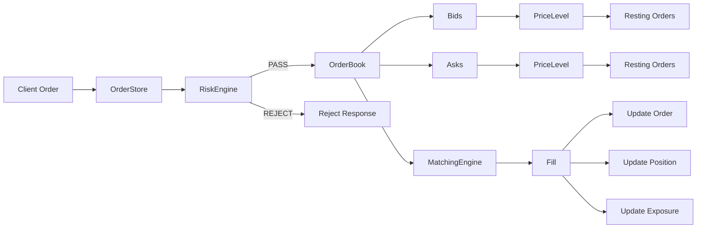
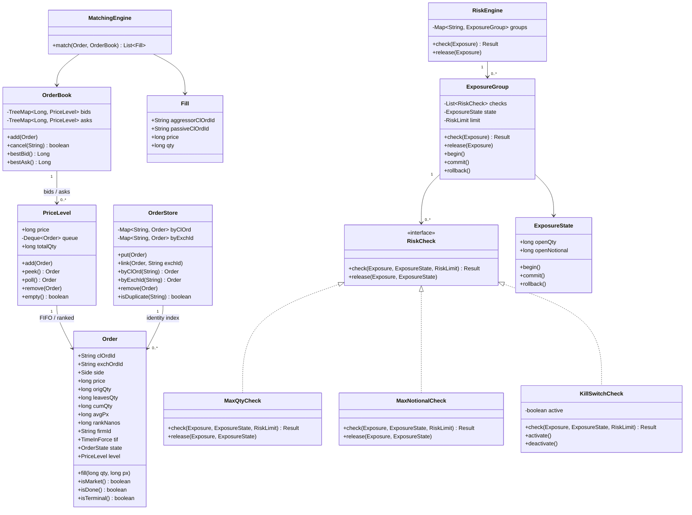
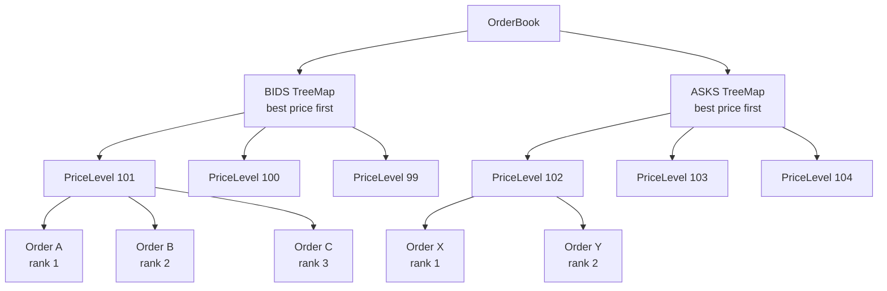
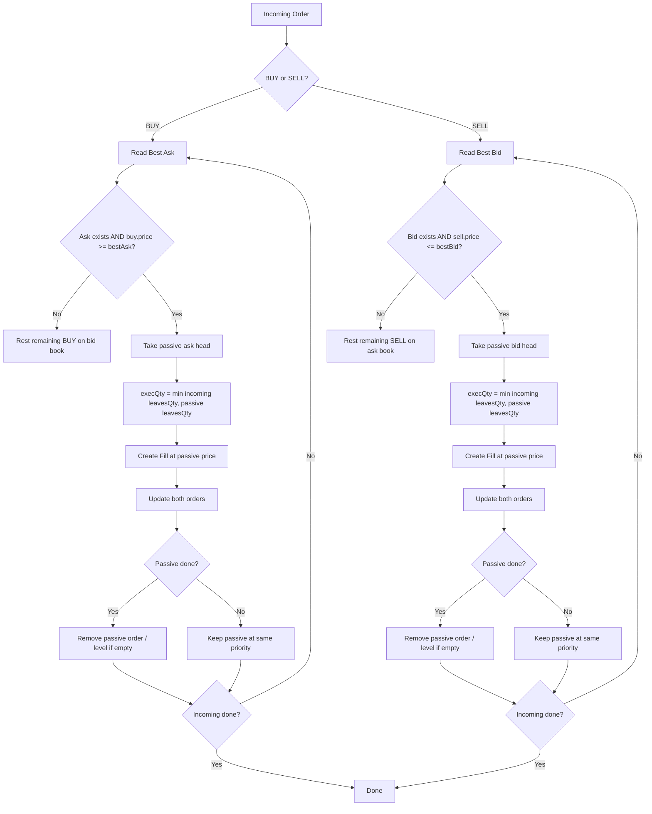
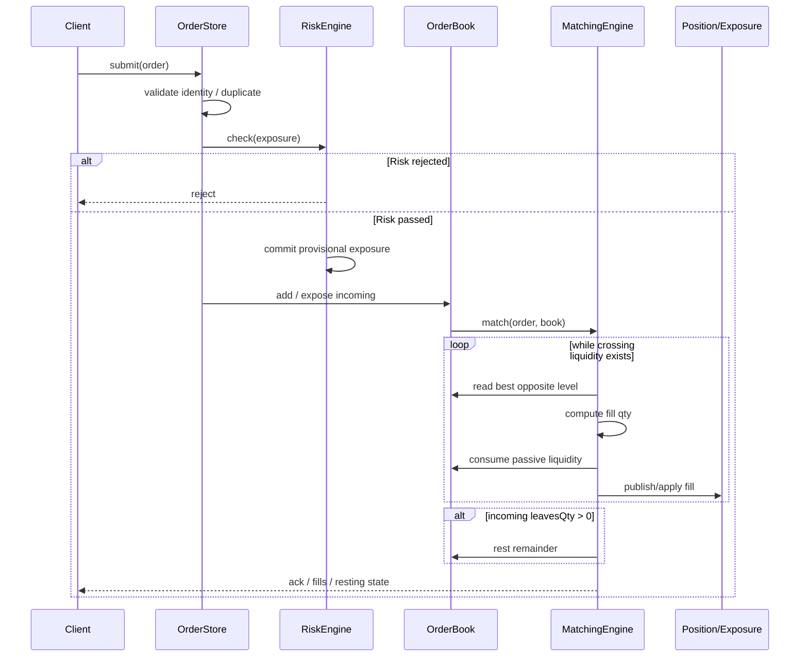
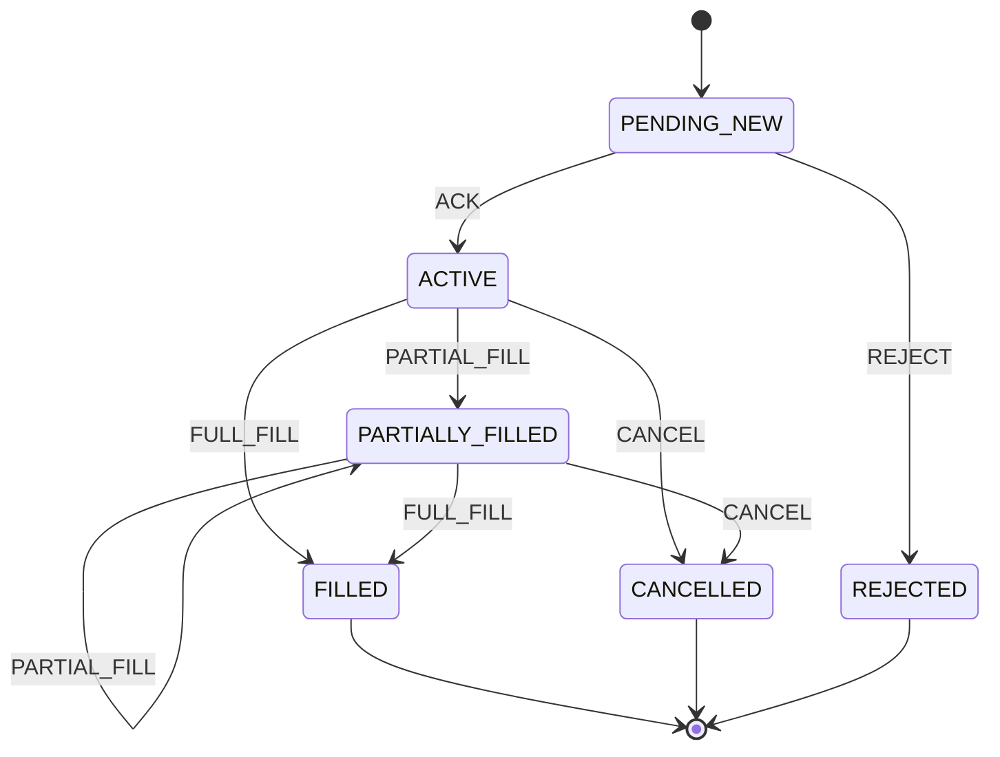
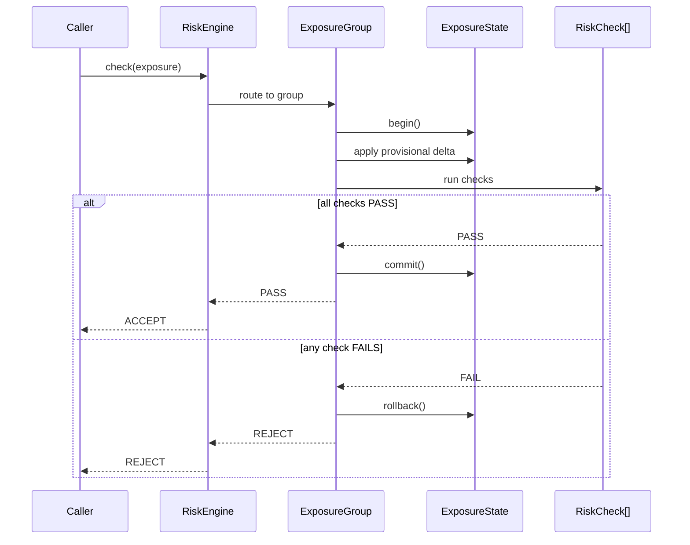
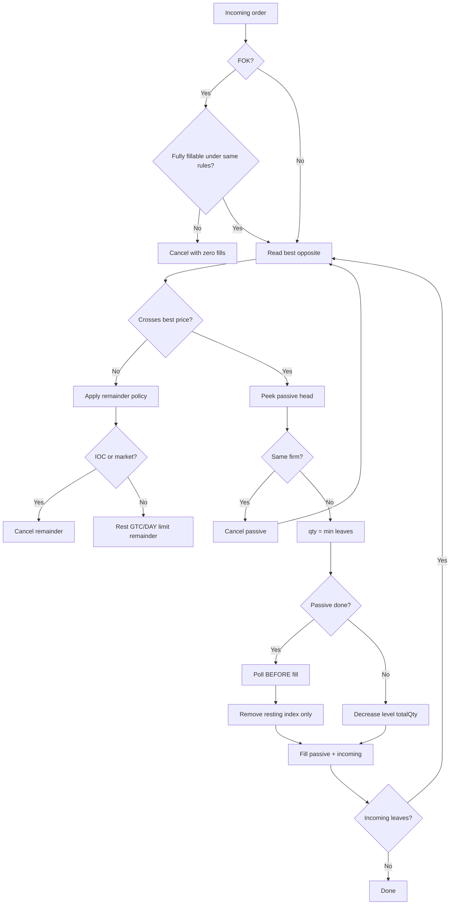
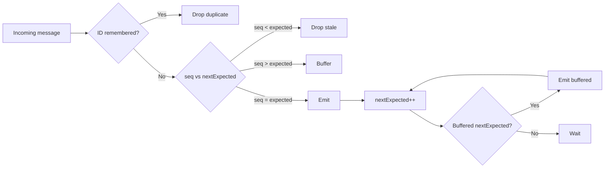
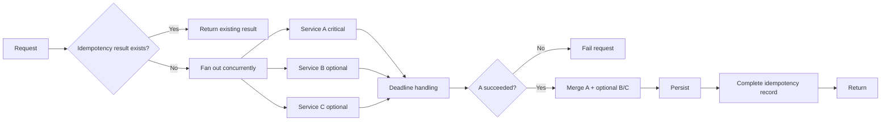

# Production-Shaped Trading LLD — Canonical Mental Model

> Goal: collapse the repeated class-diagram fragments into **one coherent trading architecture** that is easy to explain, code, and extend in an interview.

---

# 1. Core Flow

```text
ORDER FLOW

Order
  ↓
OrderStore          ← identity / lookup
  ↓
RiskEngine          ← pre-trade checks
  ↓
OrderBook           ← price levels + FIFO
  ↓
MatchingEngine      ← crossing + fills
  ↓
Order.fill()        ← lifecycle / quantity mutation
```

The key idea is:

```text
ID INDEX
→ RISK
→ ORDERED PRICE LEVEL
→ FIFO ORDER
→ CROSS
→ FILL
→ UPDATE STATE
```

---

## Mermaid Diagram — End-to-End Architecture



Mental compression:

```text
Client
→ Store identity
→ Check risk
→ Rest or match
→ Fill
→ Update order / position / exposure
```

# 2. Final Canonical Class Model

```text
                         ┌─────────────────┐
                         │      Order      │
                         │─────────────────│
                         │ clOrdId         │
                         │ exchOrdId       │
                         │ side            │
                         │ price           │
                         │ origQty         │
                         │ leavesQty       │
                         │ cumQty          │
                         │ avgPx           │
                         │ rankNanos       │
                         │ firmId          │
                         │ tif             │
                         │ state           │
                         │ level           │
                         └───────┬─────────┘
                                 │
                                 │ belongs to
                                 ▼
                         ┌─────────────────┐
                         │   PriceLevel    │
                         │─────────────────│
                         │ price           │
                         │ totalQty        │
                         │ queue<Order>    │
                         └───────┬─────────┘
                                 │
                                 │ many levels
                                 ▼
                         ┌─────────────────┐
                         │    OrderBook    │
                         │─────────────────│
                         │ bids            │
                         │ asks            │
                         │ resting orders  │
                         └───────┬─────────┘
                                 │
                           consumed by
                                 ▼
                         ┌─────────────────┐
                         │ MatchingEngine  │
                         │─────────────────│
                         │ match()         │
                         └───────┬─────────┘
                                 │
                                 ▼
                         ┌─────────────────┐
                         │      Fill       │
                         └─────────────────┘


Order ──────────────► OrderStore
                       │
                       ├── byClOrdId
                       └── byExchOrdId


Order / Exposure
      │
      ▼
┌──────────────────┐
│    RiskEngine    │
└────────┬─────────┘
         │
         ▼
┌──────────────────┐
│  ExposureGroup   │
│──────────────────│
│ checks[]         │
│ ExposureState    │
│ RiskLimit        │
└───────┬──────────┘
        │
        ├──────────────► MaxQtyCheck
        ├──────────────► MaxNotionalCheck
        └──────────────► KillSwitchCheck

All implement:

              RiskCheck
```

---

## Mermaid Diagram — Canonical Class Model



# 3. Order

## Responsibility

`Order` owns order-local identity, economics, quantity state, priority, lifecycle, and book linkage.

```text
Order
├── identity
│   ├── clOrdId
│   └── exchOrdId
│
├── economics
│   ├── side
│   ├── price
│   ├── origQty
│   ├── leavesQty
│   ├── cumQty
│   └── avgPx
│
├── priority
│   └── rankNanos
│
├── lifecycle
│   ├── state
│   ├── tif
│   └── firmId
│
└── book linkage
    └── PriceLevel level
```

## Core methods

```text
fill(qty, price)
isMarket()
isDone()
isTerminal()
```

## Core invariant

```text
origQty = cumQty + leavesQty
leavesQty >= 0
cumQty >= 0
```

A fill must preserve those invariants.

---

# 4. PriceLevel

## Responsibility

A `PriceLevel` owns all resting orders at one price.

```text
PriceLevel
├── price
├── FIFO / ranked orders
├── totalQty
├── add(order)
├── peek()
├── poll()
├── remove(order)
└── empty()
```

## Invariants

```text
Every order in a level has the same price.

totalQty =
Σ leavesQty of all resting orders at the level.

Within the level:
earlier-ranked orders come first.
```

Once price priority is resolved by the book, `PriceLevel` is responsible for time priority.

---

# 5. OrderBook

## Responsibility

The `OrderBook` owns the active resting liquidity.

```text
OrderBook
├── TreeMap<Long, PriceLevel> bids
├── TreeMap<Long, PriceLevel> asks
├── add(order)
├── cancel(clOrdId)
├── find(clOrdId)
├── bestBid()
└── bestAsk()
```

Recommended interview representation:

```java
TreeMap<Long, PriceLevel> bids =
    new TreeMap<>(Comparator.reverseOrder());

TreeMap<Long, PriceLevel> asks =
    new TreeMap<>();
```

Therefore:

```text
bids.firstEntry() → best bid
asks.firstEntry() → best ask
```

This keeps both sides mentally symmetrical:

```text
first entry = best level
```

---

## Mermaid Diagram — Price-Time Structure



Two-level priority:

```text
TreeMap
→ price priority

PriceLevel queue/list
→ time priority
```

# 6. ArrayDeque vs Production Linked Structure

For an interview:

```java
ArrayDeque<Order>
```

is excellent for:

```text
peek head   O(1)
add tail    O(1)
poll head   O(1)
```

But arbitrary cancellation is problematic:

```text
queue.remove(order)
→ O(N)
```

For a production-shaped design, prefer:

```text
HashMap<orderId, Order>
+
intrusive doubly-linked Order nodes
```

Then:

```text
find order               O(1)
unlink from PriceLevel   O(1)
remove empty level       O(log P)
```

This explains why low-latency code often uses custom linked structures rather than a normal deque.

---

# 7. OrderStore vs OrderBook Index

Do not duplicate responsibility.

Use:

```text
OrderStore
├── byClOrdId
└── byExchOrdId
```

as the authoritative identity store.

Then:

```text
OrderStore
= all known orders

OrderBook
= currently resting orders
```

Example:

```text
FILLED order

OrderStore:
may still exist for lifecycle/history lookup

OrderBook:
must no longer be present
```

That separation is cleaner than making the book the universal order registry.

---

# 8. MatchingEngine

## Responsibility

The engine does not own liquidity.

It consumes:

```text
incoming Order
+
OrderBook
```

and produces:

```text
List<Fill>
```

Think:

```text
OrderBook
= where liquidity lives

MatchingEngine
= rules for consuming liquidity
```

## Incoming BUY flow

```text
incoming BUY
    ↓
bestAsk
    ↓
incoming.price >= bestAsk.price ?
    ↓ yes
take FIFO head
    ↓
qty = min(incoming.leavesQty, passive.leavesQty)
    ↓
fill both
    ↓
remove passive if done
    ↓
repeat
```

SELL is symmetric:

```text
incoming.price <= bestBid.price
```

## Execution price

A clean interview assumption:

```text
trade occurs at the resting/passive order price
```

State this explicitly.

---

## Mermaid Diagram — Matching Flow



## Mermaid Diagram — Order Submission Sequence



# 9. Partial-Fill Priority

A partially filled resting order must normally retain its original priority.

For a heap-based interview implementation:

```text
poll passive order
fill partially
reinsert with ORIGINAL sequence/rank
```

This preserves logical time priority, but costs another heap operation.

In a per-price FIFO linked list:

```text
partially filled head
→ remains at head
```

Do not generate a new rank/sequence for the remaining quantity.

---

# 10. StateMachine

A dedicated `StateMachine` is optional.

For a small interview design, order methods may be enough:

```text
Order.fill()
Order.cancel()
Order.reject()
```

As complexity grows:

```text
simple interview
Order methods
    ↓
transition helper
    ↓
dedicated StateMachine
```

Use a separate state-machine class only when the transition graph is complex enough to justify it.

---

## Mermaid Diagram — Order Lifecycle



Invariant:

```text
origQty = cumQty + leavesQty
```

Terminal states:

```text
FILLED
CANCELLED
REJECTED
```

# 11. Risk Subsystem

The clean abstraction is:

```text
RiskEngine
   ↓
ExposureGroup
   ↓
RiskCheck[]
```

Interpretation:

```text
RiskEngine
= routing / orchestration

ExposureGroup
= one risk context + transactional exposure state

RiskCheck
= one independent policy
```

Example:

```java
interface RiskCheck {
    Result check(
        Exposure exposure,
        ExposureState state,
        RiskLimit limit
    );

    void release(
        Exposure exposure,
        ExposureState state
    );
}
```

Possible implementations:

```text
MaxQtyCheck
MaxNotionalCheck
PriceDeviationCheck
RateLimitCheck
KillSwitchCheck
```

This is effectively:

```text
Strategy Pattern
+
check pipeline
```

---

# 12. ExposureState and Transaction Semantics

This is important senior-level design depth.

```text
begin()
   ↓
apply provisional exposure
   ↓
run all checks
   ↓
ALL PASS?
   ├── YES → commit()
   └── NO  → rollback()
```

## Core invariant

```text
A rejected order must leave risk state
exactly as though the order had never been accepted.
```

One implementation model:

```text
committedOpenQty
committedOpenNotional

workingOpenQty
workingOpenNotional
```

Alternative:

```text
committed state
+
undo delta
```

The invariant matters more than the literal representation.

---

## Mermaid Diagram — Transactional Risk Check



Core invariant:

```text
Rejected order
→ risk state must be exactly as before the attempt.
```

# 13. Kill Switch

A simple interview field:

```java
volatile boolean active;
```

Meaning:

```text
active = true
→ reject all applicable new risk-taking activity
```

Discussion:

```text
volatile
→ visibility

AtomicBoolean
→ visibility + atomic operations

distributed control plane
→ cluster-wide consistency problem
```

For LLD interviews, `volatile boolean` is reasonable unless stronger coordination is required.

---

# 14. LRU Cache

Keep LRU outside the core matching-engine model unless the interviewer explicitly asks for:

```text
dedupe cache
reference-data cache
session cache
bounded lookup cache
```

Canonical structure:

```text
HashMap<K, Node<K,V>>
+
doubly linked list
```

Operations:

```text
get       O(1)
put       O(1)
remove    O(1)
eviction  O(1)
```

It is a reusable infrastructure component, not inherently part of the order book.

---

# 15. Final Whiteboard Architecture

```text
                   OrderStore
                       │
                       ▼
Client Order → RiskEngine
                       │ PASS
                       ▼
                  OrderBook
              ┌────────┴────────┐
              │                 │
           bids              asks
              │                 │
         PriceLevel        PriceLevel
              │                 │
          FIFO Order        FIFO Order
              └────────┬────────┘
                       │
                       ▼
                MatchingEngine
                       │
                       ▼
                     Fill
```

Explanation:

```text
OrderStore
→ identity

RiskEngine
→ may this order enter?

OrderBook
→ where does liquidity rest?

PriceLevel
→ price priority already resolved;
  preserve time priority here

MatchingEngine
→ does incoming order cross?
  if yes, consume best opposite liquidity

Fill
→ mutate cumQty / leavesQty / state
  and later update position / exposure
```

---

# 16. Class Relationship Summary

```text
OrderBook "1" --> "0..*" PriceLevel : bids / asks
PriceLevel "1" --> "0..*" Order : FIFO / ranked queue
OrderStore "1" --> "0..*" Order : byClOrd / byExchId
MatchingEngine --> OrderBook
MatchingEngine --> Fill
ExposureGroup --> ExposureState
ExposureGroup "1" --> "0..*" RiskCheck
RiskEngine "1" --> "0..*" ExposureGroup
LRUCache --> Node
```

---

# 17. Responsibilities at a Glance

| Class | Responsibility |
|---|---|
| `Order` | identity, economics, quantity, lifecycle |
| `PriceLevel` | same-price queue + aggregate quantity |
| `OrderBook` | ordered active liquidity |
| `OrderStore` | authoritative ID lookup |
| `MatchingEngine` | crossing and fill generation |
| `Fill` | execution result |
| `RiskEngine` | route/check exposure |
| `ExposureGroup` | transactional risk state + checks |
| `RiskCheck` | one policy |
| `ExposureState` | committed/provisional risk consumption |
| `StateMachine` | optional lifecycle transition abstraction |
| `LRUCache` | optional bounded infrastructure cache |

---

# 18. Interview vs Production Trade-Offs

## Interview

Prefer:

```text
TreeMap
ArrayDeque
HashMap
simple enums
small interfaces
clear invariants
```

Why?

Because they are:

```text
fast to write
easy to explain
easy to verify
standard-library based
```

## Production low-latency engine

May prefer:

```text
custom PriceList
intrusive OrderList
object pools
primitive/scaled values
fixed arrays
single-writer ownership
zero-allocation hot path
framework sequencing
```

Why?

Because the production target is not just:

```text
good asymptotic complexity
```

It is also:

```text
predictable tail latency
low allocation
cache locality
deterministic behavior
fast cancellation
stable sequencing
```

---

# 19. Core Invariants to Memorize

## Order

```text
origQty = cumQty + leavesQty
```

## PriceLevel

```text
totalQty = Σ leavesQty
```

## OrderBook

```text
best bid = highest active bid level
best ask = lowest active ask level
```

## Price-Time Priority

```text
better price first
same price → earlier rank first
```

## Matching

```text
BUY crosses if buyPrice >= bestAsk
SELL crosses if sellPrice <= bestBid
```

## Risk

```text
reject → rollback provisional exposure completely
```

## Store vs Book

```text
OrderStore = known identity/lifecycle
OrderBook  = currently resting liquidity
```

---

# 20. One-Line Mental Compression

```text
ORDER
→ STORE ID
→ CHECK RISK
→ REST BY PRICE
→ FIFO BY TIME
→ CROSS OPPOSITE
→ CREATE FILL
→ UPDATE ORDER / POSITION / EXPOSURE
```

That is the canonical model to internalize.

---

# 21. Latest Canonical Code Contracts — Corrected

This section incorporates the latest consolidated code notes into the same architecture. It keeps the **interview-simple model**, but fixes the correctness traps that matter in a real trading LLD.

## 21.1 Canonical enums

```java
enum Side {
    BUY, SELL
}

enum TimeInForce {
    IOC, FOK, GTC, DAY
}

enum Result {
    PASS, BREACH, KILL
}

enum OrderState {
    PENDING_ACK,
    ACKNOWLEDGED,
    PARTIALLY_FILLED,

    FILLED,
    CANCELLED,
    REJECTED,

    PENDING_CANCEL,
    PENDING_REPLACE;

    boolean terminal() {
        return this == FILLED
                || this == CANCELLED
                || this == REJECTED;
    }
}
```

---

# 22. Canonical `Order`

```java
class Order {

    // Identity
    final String clOrdId;
    String exchOrdId;

    // Economics
    final Side side;
    final long price;       // integer ticks; Long.MIN_VALUE = market
    final long origQty;

    // Fill state
    long leavesQty;
    long cumQty;
    long avgPx;

    // Book / priority context
    PriceLevel level;
    long rankNanos;

    // Matching / OMS context
    String firmId;
    TimeInForce tif;
    OrderState state;

    void fill(long qty, long px) {

        if (qty <= 0) {
            throw new IllegalArgumentException("fill qty must be > 0");
        }

        if (qty > leavesQty) {
            throw new IllegalArgumentException("overfill");
        }

        long newCum = Math.addExact(cumQty, qty);

        long oldValue = Math.multiplyExact(avgPx, cumQty);
        long newValue = Math.multiplyExact(px, qty);

        avgPx = Math.addExact(oldValue, newValue) / newCum;

        cumQty = newCum;
        leavesQty -= qty;

        state = leavesQty == 0
                ? OrderState.FILLED
                : OrderState.PARTIALLY_FILLED;
    }

    boolean isMarket() {
        return price == Long.MIN_VALUE;
    }

    boolean isDone() {
        return leavesQty == 0;
    }

    boolean isTerminal() {
        return state != null && state.terminal();
    }
}
```

## Order invariants

```text
origQty = cumQty + leavesQty
0 <= leavesQty <= origQty
0 <= cumQty <= origQty
```

## Ranking nuance

`rankNanos` is fine as an interview shorthand, but timestamps can tie.

A deterministic production ranking is better thought of as:

```text
(transactionTimeNanos, sequenceNumber)
```

---

# 23. Canonical `PriceLevel`

```java
class PriceLevel {

    final long price;
    final ArrayDeque<Order> queue = new ArrayDeque<>();

    long totalQty;

    PriceLevel(long price) {
        this.price = price;
    }

    void add(Order o) {
        queue.addLast(o);
        totalQty = Math.addExact(totalQty, o.leavesQty);
        o.level = this;
    }

    Order peek() {
        return queue.peekFirst();
    }

    Order poll() {

        Order o = queue.pollFirst();

        if (o != null) {
            /*
             * IMPORTANT:
             * subtract BEFORE fill mutates leavesQty.
             */
            totalQty -= o.leavesQty;
            o.level = null;
        }

        return o;
    }

    boolean remove(Order o) {

        /*
         * ArrayDeque.remove is O(number of orders at this level).
         */
        if (!queue.remove(o)) {
            return false;
        }

        totalQty -= o.leavesQty;
        o.level = null;

        return true;
    }

    boolean empty() {
        return queue.isEmpty();
    }
}
```

## Critical ownership rule

```text
If poll() physically removes an order,
do not call cancel/remove on that same PriceLevel again.
```

The pasted matching sketch had this dangerous shape:

```text
level.poll()
↓
book.cancel(passive)
↓
level.remove(passive) again
```

That can subtract the level quantity twice.

The correct rule is:

```text
physical queue unlink happens exactly once
index removal happens separately
```

---

# 24. Canonical `OrderBook`

For interview code, the book may keep a **resting-only** index:

```java
class OrderBook {

    final TreeMap<Long, PriceLevel> bids =
            new TreeMap<>(Comparator.reverseOrder());

    final TreeMap<Long, PriceLevel> asks =
            new TreeMap<>();

    /*
     * Resting liquidity only.
     * Not the authoritative lifetime OMS store.
     */
    final HashMap<String, Order> restingByClOrd =
            new HashMap<>();

    void add(Order o) {

        TreeMap<Long, PriceLevel> side =
                sideMap(o.side);

        PriceLevel level =
                side.computeIfAbsent(
                        o.price,
                        PriceLevel::new);

        level.add(o);
        restingByClOrd.put(o.clOrdId, o);
    }

    boolean cancel(String clOrdId) {

        Order o =
                restingByClOrd.get(clOrdId);

        if (o == null || o.level == null) {
            return false;
        }

        PriceLevel level = o.level;

        if (!level.remove(o)) {
            return false;
        }

        restingByClOrd.remove(clOrdId);

        if (level.empty()) {
            sideMap(o.side).remove(level.price);
        }

        o.state = OrderState.CANCELLED;
        return true;
    }

    Order findResting(String id) {
        return restingByClOrd.get(id);
    }

    Long bestBid() {
        return bids.isEmpty()
                ? null
                : bids.firstKey();
    }

    Long bestAsk() {
        return asks.isEmpty()
                ? null
                : asks.firstKey();
    }

    void forgetDequeued(Order o) {
        /*
         * MatchingEngine already removed it from PriceLevel.
         */
        restingByClOrd.remove(o.clOrdId);
    }

    void removeLevelIfEmpty(
            Side side,
            PriceLevel level) {

        if (level.empty()) {
            sideMap(side).remove(level.price);
        }
    }

    private TreeMap<Long, PriceLevel>
    sideMap(Side side) {

        return side == Side.BUY
                ? bids
                : asks;
    }
}
```

## Complexity nuance

The `Order.level` back-pointer gives:

```text
order → PriceLevel
```

in O(1), but:

```java
ArrayDeque.remove(order)
```

is still:

```text
O(number of orders at that price level)
```

Therefore the simple interview design is **not true O(1) cancellation**.

For production:

```text
HashMap<orderId, OrderNode>
+
intrusive doubly linked OrderList
```

can make the unlink itself O(1).

---

# 25. `OrderStore` vs Resting Book Index

Use `OrderStore` as the authoritative identity/lifecycle lookup.

```java
class OrderStore {

    private final Map<String, Order> byClOrd =
            new HashMap<>();

    private final Map<String, Order> byExchId =
            new HashMap<>();

    void put(Order o) {

        if (byClOrd.putIfAbsent(
                o.clOrdId,
                o) != null) {

            throw new IllegalArgumentException(
                    "duplicate clOrdId: " + o.clOrdId);
        }
    }

    void link(Order o, String exchId) {

        Objects.requireNonNull(exchId);

        Order previous =
                byExchId.putIfAbsent(
                        exchId,
                        o);

        if (previous != null
                && previous != o) {

            throw new IllegalArgumentException(
                    "duplicate exchOrdId: " + exchId);
        }

        o.exchOrdId = exchId;
    }

    Order byClOrd(String id) {
        return byClOrd.get(id);
    }

    Order byExchId(String id) {
        return byExchId.get(id);
    }

    boolean isDuplicate(String id) {
        return byClOrd.containsKey(id);
    }

    void remove(Order o) {

        byClOrd.remove(
                o.clOrdId,
                o);

        if (o.exchOrdId != null) {
            byExchId.remove(
                    o.exchOrdId,
                    o);
        }
    }
}
```

Mental separation:

```text
OrderStore
= known identity / lifecycle

OrderBook.restingByClOrd
= currently resting liquidity only
```

A FILLED order can remain in OMS/history while being absent from the book.

---

# 26. Corrected Matching Engine

```java
record Fill(
        String aggressorClOrdId,
        String passiveClOrdId,
        long price,
        long qty
) {}
```

## Core algorithm

```java
class MatchingEngine {

    List<Fill> match(
            Order incoming,
            OrderBook book) {

        List<Fill> fills =
                new ArrayList<>();

        /*
         * FOK must be all-or-none.
         */
        if (incoming.tif == TimeInForce.FOK
                && !canFullyFill(incoming, book)) {

            incoming.state =
                    OrderState.CANCELLED;

            return fills;
        }

        TreeMap<Long, PriceLevel> opposite =
                incoming.side == Side.BUY
                        ? book.asks
                        : book.bids;

        while (incoming.leavesQty > 0
                && !opposite.isEmpty()) {

            Map.Entry<Long, PriceLevel> best =
                    opposite.firstEntry();

            long passivePrice =
                    best.getKey();

            if (!crosses(
                    incoming,
                    passivePrice)) {

                break;
            }

            PriceLevel level =
                    best.getValue();

            while (incoming.leavesQty > 0
                    && !level.empty()) {

                Order passive =
                        level.peek();

                /*
                 * Exercise SMP policy:
                 * cancel passive self-order.
                 */
                if (Objects.equals(
                        passive.firmId,
                        incoming.firmId)) {

                    book.cancel(
                            passive.clOrdId);

                    continue;
                }

                long qty =
                        Math.min(
                                incoming.leavesQty,
                                passive.leavesQty);

                long execPrice =
                        passivePrice;

                boolean passiveDone =
                        qty == passive.leavesQty;

                if (passiveDone) {

                    /*
                     * Poll BEFORE fill because poll subtracts
                     * the current leavesQty.
                     */
                    Order removed =
                            level.poll();

                    if (removed != passive) {
                        throw new IllegalStateException(
                                "price-time queue corrupted");
                    }

                    /*
                     * Do NOT cancel/remove from level again.
                     */
                    book.forgetDequeued(
                            passive);

                } else {

                    /*
                     * Passive remains at the head.
                     * Only aggregate quantity changes.
                     */
                    level.totalQty -= qty;
                }

                passive.fill(
                        qty,
                        execPrice);

                incoming.fill(
                        qty,
                        execPrice);

                fills.add(
                        new Fill(
                                incoming.clOrdId,
                                passive.clOrdId,
                                execPrice,
                                qty));
            }

            book.removeLevelIfEmpty(
                    incoming.side == Side.BUY
                            ? Side.SELL
                            : Side.BUY,
                    level);
        }

        afterMatch(
                incoming,
                book);

        return fills;
    }

    private void afterMatch(
            Order order,
            OrderBook book) {

        if (order.isDone()) {
            return;
        }

        /*
         * IOC:
         * execute what is available, cancel remainder.
         *
         * Market remainder cannot rest either.
         */
        if (order.tif == TimeInForce.IOC
                || order.isMarket()) {

            order.state =
                    OrderState.CANCELLED;

            return;
        }

        /*
         * FOK should have been fully fillable before
         * any mutation occurred.
         */
        if (order.tif == TimeInForce.FOK) {

            throw new IllegalStateException(
                    "FOK partially executed");
        }

        /*
         * GTC / DAY limit remainder rests.
         */
        book.add(order);
    }

    private boolean crosses(
            Order order,
            long bestOppositePrice) {

        if (order.isMarket()) {
            return true;
        }

        return order.side == Side.BUY
                ? order.price >= bestOppositePrice
                : order.price <= bestOppositePrice;
    }

    private boolean canFullyFill(
            Order incoming,
            OrderBook book) {

        long required =
                incoming.leavesQty;

        NavigableMap<Long, PriceLevel> opposite =
                incoming.side == Side.BUY
                        ? book.asks
                        : book.bids;

        for (Map.Entry<Long, PriceLevel> e
                : opposite.entrySet()) {

            if (!crosses(
                    incoming,
                    e.getKey())) {

                break;
            }

            for (Order passive
                    : e.getValue().queue) {

                /*
                 * FOK pre-check must use the SAME
                 * eligibility rules as actual matching.
                 */
                if (Objects.equals(
                        passive.firmId,
                        incoming.firmId)) {

                    continue;
                }

                required -=
                        passive.leavesQty;

                if (required <= 0) {
                    return true;
                }
            }
        }

        return false;
    }
}
```

## Correct full-fill ownership

```text
FULL PASSIVE FILL

level.poll()
→ queue unlink
→ subtract pre-fill leavesQty

book.forgetDequeued()
→ resting index only

passive.fill()
→ lifecycle / quantity mutation
```

One responsibility, one mutation owner.

## Time-in-force distinction

```text
IOC
→ fill whatever is immediately available
→ cancel remainder

FOK
→ fill entire requested quantity
→ OR execute nothing

GTC
→ unmatched limit remainder may rest

DAY
→ unmatched limit remainder may rest until session/day expiry
```

---

## Mermaid — Matching + Time-in-Force



---

# 27. Transactional Risk Model

## Interface

```java
interface RiskCheck {

    Result check(
            Exposure exposure,
            ExposureState state,
            RiskLimit limit);

    void release(
            Exposure exposure,
            ExposureState state);
}
```

## State

```java
class ExposureState {

    long openQty;
    long openNotional;

    private long savedQty;
    private long savedNotional;

    void begin() {
        savedQty = openQty;
        savedNotional = openNotional;
    }

    void commit() {
        // logically discard snapshot
    }

    void rollback() {
        openQty = savedQty;
        openNotional = savedNotional;
    }
}
```

## Safer ownership

```java
class ExposureGroup {

    final List<RiskCheck> checks;
    final ExposureState state =
            new ExposureState();
    final RiskLimit limit;

    Result evaluate(Exposure exposure) {

        state.begin();

        try {

            for (RiskCheck check : checks) {

                Result result =
                        check.check(
                                exposure,
                                state,
                                limit);

                if (result != Result.PASS) {
                    state.rollback();
                    return result;
                }
            }

            state.commit();
            return Result.PASS;

        } catch (RuntimeException e) {

            state.rollback();
            throw e;
        }
    }

    void release(Exposure exposure) {

        for (RiskCheck check : checks) {
            check.release(
                    exposure,
                    state);
        }
    }
}
```

Core invariant:

```text
REJECT OR EXCEPTION
→ risk state exactly returns to pre-attempt state
```

If multiple hierarchical exposure groups mutate together, the transaction boundary must cover all affected groups consistently.

---

# 28. Complete LRU Skeleton

```java
class Node<K, V> {

    K key;
    V value;

    Node<K, V> prev;
    Node<K, V> next;

    Node() {}

    Node(K key, V value) {
        this.key = key;
        this.value = value;
    }
}

class LRUCache<K, V> {

    private final int capacity;

    private final Map<K, Node<K, V>> map =
            new HashMap<>();

    /*
     * head.next = MRU
     * tail.prev = LRU
     */
    private final Node<K, V> head =
            new Node<>();

    private final Node<K, V> tail =
            new Node<>();

    LRUCache(int capacity) {

        if (capacity <= 0) {
            throw new IllegalArgumentException(
                    "capacity must be > 0");
        }

        this.capacity = capacity;

        head.next = tail;
        tail.prev = head;
    }

    V get(K key) {

        Node<K, V> node =
                map.get(key);

        if (node == null) {
            return null;
        }

        moveToHead(node);
        return node.value;
    }

    void put(K key, V value) {

        Node<K, V> node =
                map.get(key);

        if (node != null) {
            node.value = value;
            moveToHead(node);
            return;
        }

        node = new Node<>(
                key,
                value);

        map.put(
                key,
                node);

        addToHead(
                node);

        if (map.size() > capacity) {

            Node<K, V> lru =
                    removeTail();

            map.remove(
                    lru.key);
        }
    }

    boolean remove(K key) {

        Node<K, V> node =
                map.remove(key);

        if (node == null) {
            return false;
        }

        removeNode(node);
        return true;
    }

    private void addToHead(
            Node<K, V> node) {

        node.prev = head;
        node.next = head.next;

        head.next.prev = node;
        head.next = node;
    }

    private void removeNode(
            Node<K, V> node) {

        node.prev.next = node.next;
        node.next.prev = node.prev;
    }

    private void moveToHead(
            Node<K, V> node) {

        removeNode(node);
        addToHead(node);
    }

    private Node<K, V> removeTail() {

        Node<K, V> lru =
                tail.prev;

        removeNode(lru);
        return lru;
    }
}
```

```text
get      expected O(1)
put      expected O(1)
remove   expected O(1)
evict    expected O(1)
space    O(capacity)
```

---

# 29. Sequence Reordering

The simple exact reconstruction pattern is:

```text
nextExpected
+
TreeMap<sequence, message>
```

```java
class ReorderBuffer<T> {

    private long nextExpected;

    private final TreeMap<Long, T> pending =
            new TreeMap<>();

    ReorderBuffer(long firstExpected) {
        nextExpected = firstExpected;
    }

    List<T> receive(
            long seq,
            T message) {

        List<T> ready =
                new ArrayList<>();

        if (seq < nextExpected) {
            return ready;
        }

        pending.putIfAbsent(
                seq,
                message);

        while (true) {

            T next =
                    pending.remove(
                            nextExpected);

            if (next == null) {
                break;
            }

            ready.add(next);
            nextExpected++;
        }

        return ready;
    }
}
```

```text
insert/remove   O(log W)
space           O(W)
```

where `W` is the number of buffered out-of-order messages.

---

# 30. Correct Bounded Dedup

This is **not valid Java**:

```java
new LinkedHashSet<>() {
    protected boolean removeEldestEntry(...) { ... }
}
```

`removeEldestEntry()` belongs to `LinkedHashMap`.

Correct bounded remembered-set skeleton:

```java
class BoundedDedupSet<K> {

    private final Map<K, Boolean> seen;

    BoundedDedupSet(int capacity) {

        seen =
                new LinkedHashMap<>(
                        capacity,
                        0.75f,
                        false) {

                    @Override
                    protected boolean
                    removeEldestEntry(
                            Map.Entry<K, Boolean> eldest) {

                        return size() > capacity;
                    }
                };
    }

    /*
     * true  = first time while retained
     * false = duplicate still remembered
     */
    boolean firstTime(K key) {

        if (seen.containsKey(key)) {
            return false;
        }

        seen.put(
                key,
                Boolean.TRUE);

        return true;
    }
}
```

## Why insertion order can be right for dedup

Duplicates often should **not refresh retention**.

Therefore bounded dedup may intentionally retain based on:

```text
first accepted arrival
```

rather than true access-order LRU.

## Limitation

Any bounded set gives only a bounded guarantee:

```text
ID evicted
→ same ID arrives much later
→ can be accepted again
```

So bounded memory means bounded dedup history.

---

## Mermaid — Sequence + Dedup Gate



---

# 31. Resilient Fan-Out Aggregator — Keep Outside the Matching Hot Path

The pasted service example combines:

```text
idempotency
parallel fan-out
bulkheads
per-service timeout
overall deadline
partial failure
retry
persistence
```

This is a strong **backend/system-design pattern**, but it belongs outside the deterministic matching-engine hot path.

## Architecture



## Good principles

```text
independent calls run concurrently
separate bulkheads isolate dependencies
critical dependency failure fails request
optional dependency failure degrades response
retries target transient failures only
overall deadline bounds user latency
idempotency protects repeated requests
```

## Corrections worth remembering

### 1. `completeOnTimeout()` does not guarantee underlying work stops

The future may complete with `null`, while the actual remote call/thread continues.

Use dependency-native deadlines and cancellation where possible.

### 2. Restore interrupt status

```java
catch (InterruptedException e) {
    Thread.currentThread().interrupt();
    ...
}
```

### 3. `newFixedThreadPool()` uses an unbounded queue

It limits workers but does not provide strong bounded backpressure.

For a true bulkhead, consider:

```text
bounded ThreadPoolExecutor
semaphore isolation
explicit rejection policy
```

### 4. Cache check + later `setIfAbsent` is not atomic idempotency

Two same-key requests can both:

```text
miss
call dependencies
persist
```

before either writes the cache.

The idempotency mechanism must protect the **durable side effect**, not only the response cache.

### 5. Retry must fit remaining deadline

Do not think only:

```text
max retries = 3
```

Think:

```text
transient?
retry-safe?
remaining deadline enough?
```

### 6. Retry with jitter

Exponential backoff without jitter can synchronize callers into another spike.

---

# 32. What to Draw in a 20-Minute Interview

## First 5 minutes

```text
Order
PriceLevel
OrderBook
MatchingEngine
Fill
```

## Add for cancellation / OMS

```text
OrderStore
OrderState
TimeInForce
```

## Add for risk

```text
RiskEngine
ExposureGroup
RiskCheck
ExposureState
```

## Add only when asked

```text
LRUCache
sequence reorder
bounded dedup
remote fan-out resilience
```

Do not draw every class simply because you know it.

---

# 33. Final Invariant Stack

```text
ORDER
origQty = cumQty + leavesQty

PRICE LEVEL
totalQty = Σ resting leavesQty at this price

BOOK
best bid = highest active bid
best ask = lowest active ask

PRICE-TIME
better price first
same price → earlier rank first

PARTIAL FILL
resting order keeps its priority

FULL PASSIVE FILL
physical removal happens exactly once

MATCH
execution price = passive price for this exercise

IOC
fill available quantity, cancel remainder

FOK
all requested quantity or zero execution

STORE
identity lifetime != resting-book lifetime

RISK
reject/exception restores pre-attempt exposure

SEQUENCE
emit only legal next sequence

DEDUP
bounded memory = bounded dedup guarantee

REMOTE AGGREGATION
idempotency protects durable side effects,
not merely cached responses
```

---

# 34. Final Mental Compression

```text
TRADING HOT PATH

ORDER
→ IDENTITY
→ RISK
→ BEST OPPOSITE PRICE
→ PRICE-TIME MATCH
→ FILL
→ UPDATE LEAVES/CUM/STATE
→ APPLY TIF
→ POSITION / EXPOSURE


SUPPORTING INFRA

SEQUENCE
→ DEDUP
→ CACHE
→ RECOVERY


REMOTE BACKEND PATH

BULKHEAD
→ TIMEOUT
→ DEADLINE
→ TRANSIENT RETRY
→ PARTIAL FAILURE
→ DURABLE IDEMPOTENCY
```

The strongest design boundary to remember is:

> **Do not put Redis, remote retries, thread-pool fan-out, or network aggregation inside the deterministic low-latency matching hot path.**
